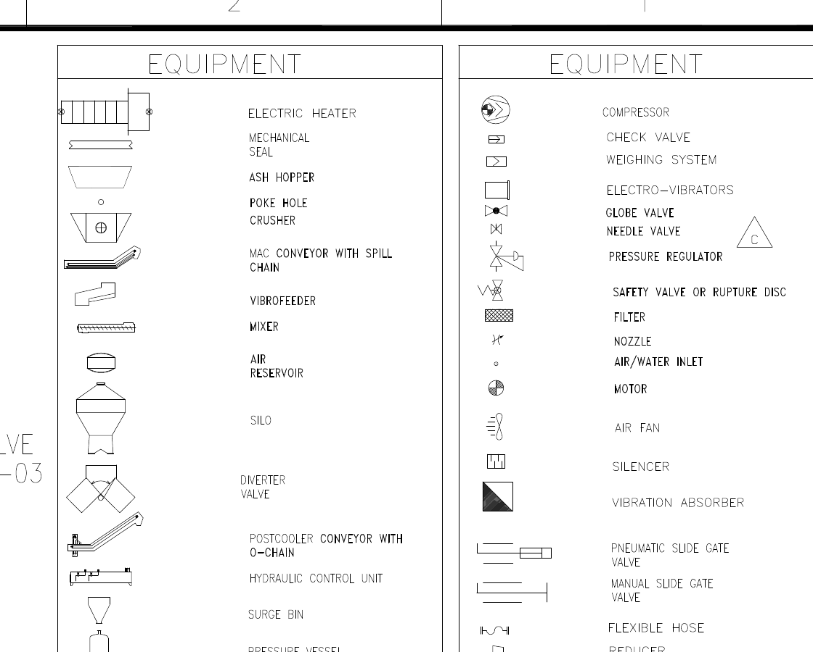

# P&ID를 처음 읽는 분을 위한 안내

P&ID를 이해한다는 것은 도면에 있는 모든 기호를 외운다는 뜻이 아닙니다. 먼저 어떤 장비가 있고, 장비가 무엇으로 연결되어 있으며, 어디에서 측정하고 제어하는지를 원본 근거와 함께 설명할 수 있어야 합니다.

이 단원에서는 실제 샘플 도면을 천천히 살펴봅니다. 도면을 처음 보는 분도 이후의 AI 실습에서 막히지 않도록, 현업 질문을 읽는 방법부터 전문가가 근거를 확인하는 순서까지 하나씩 따라가겠습니다.

## P&ID는 어떤 도면인가요?

P&ID는 `Piping and Instrumentation Diagram`의 약자입니다. 우리말로는 보통 `배관 및 계장도`라고 부릅니다.

이 도면은 공정 안에 어떤 장비가 있고, 장비 사이를 어떤 배관이 연결하며, 어디에서 압력·온도·유량·수위 등을 측정하고 제어하는지 보여 줍니다.

P&ID를 건물의 평면도처럼 생각하면 혼란스러울 수 있습니다. P&ID에 그려진 선의 길이는 실제 배관 길이를 의미하지 않습니다. 장비 사이의 간격도 실제 설치 거리가 아닙니다. P&ID의 목적은 `어디에 놓여 있는가`보다 `무엇이 어떻게 연결되어 있는가`를 보여 주는 것입니다.

처음 이 그림을 보면 작은 글자와 선이 너무 많아 어디부터 봐야 할지 막막합니다. 전문가도 처음부터 모든 태그를 읽지 않습니다. 먼저 도면의 신분증과 큰 구조를 확인합니다.

## 첫 번째로 확인할 곳: 도면의 신분증

도면 오른쪽 아래에는 제목란이 있습니다. 제목란에는 도면 제목, 도면번호, 시트 번호와 개정 번호가 들어 있습니다.

이 샘플에서는 다음 정보를 확인할 수 있습니다.

- 도면 제목: `DRY BOTTOM ASH HANDLING SYSTEM (5/5)`
- 도면 식별자: `J-11520-ZM-105-005`
- 개정 번호: `Rev. F`
- 상태: `AS BUILT`

`5/5`는 같은 계통을 설명하는 다섯 장 가운데 다섯 번째 시트라는 뜻입니다. 현업 질문에 `Bottom Ash`가 들어 있다고 해서 이 한 장만 바로 정답으로 선택할 수는 없습니다. 1/5부터 5/5까지 같은 제목을 가진 도면이 있을 수 있기 때문입니다.

`AS BUILT`는 준공 당시의 설치 상태를 반영한 도면이라는 뜻입니다. 실제 업무에서는 AS BUILT라는 문구만 보고 최신 도면이라고 단정하지 않고, 문서관리시스템에서 승인 상태와 최신 revision을 다시 확인합니다.

## 두 번째로 확인할 곳: 범례

도면 오른쪽 위에는 장비와 선의 기호를 설명하는 범례가 있습니다.

범례는 P&ID를 읽기 위한 사전과 같습니다. 도면 본문에서 모양이 비슷한 기호를 보았을 때, 기억에 의존하지 않고 범례와 대조할 수 있습니다.

이 샘플 범례에는 Vibro Feeder, Diverter Valve, Flexible Hose, Motor, Expansion Joint 등의 기호가 포함되어 있습니다.

여기에서 중요한 점이 하나 있습니다. 기호 근처에 글자가 있다고 해서 그 글자가 반드시 해당 기호의 태그는 아닙니다. 여러 장비와 연결부가 가까이 그려져 있기 때문에, 글자의 위치와 연결선을 함께 살펴봐야 합니다.

## 세 번째로 확인할 곳: 큰 장비와 반복 구조

도면 중앙에는 `RECEPTION BIN 1`, `RECEPTION BIN 2`, `RECEPTION BIN 3`이 반복해서 나타납니다. 각 Bin 아래에는 Vibro Feeder와 여러 계기·밸브가 연결되어 있습니다.

반복 구조를 발견하면 도면을 읽기가 쉬워집니다. 한 구역의 구조를 이해한 뒤 옆 구역과 비교할 수 있기 때문입니다. 다만 반복된다고 해서 모든 태그가 같지는 않습니다. 질문에서 요구하는 `#C`처럼 작은 구분자를 확인해야 합니다.

## P&ID에서 자주 만나는 구성요소

### 장비

장비는 공정에서 실제 기능을 수행하는 대상입니다. 이 샘플에서는 다음 장비명을 볼 수 있습니다.

- `Reception Bin`: 물질을 받아 잠시 저장하는 빈입니다.
- `Vibro Feeder`: 진동을 이용하여 고체 물질을 다음 설비로 보냅니다.
- `Diverter Valve`: 흐름을 여러 경로 가운데 하나로 전환합니다.
- `Coal Feeder`: 석탄을 일정하게 공급하는 장비입니다.
- `Pulverizer`: 석탄을 미세하게 분쇄하는 장비입니다.

장비의 일반적인 기능은 공정 지식을 이용한 설명입니다. 반면 `VIBRO FEEDER #C`라는 글자가 보인다는 사실은 이미지에서 직접 확인한 관찰입니다. 이후 AI 결과를 검토할 때 이 둘을 구분해야 합니다.

### 배관과 연결선

선은 장비 사이의 연결을 나타냅니다. 공정 배관, 공기 배관, 전기 신호 등은 서로 다른 선 모양으로 표시될 수 있습니다.

선 두 개가 교차한다고 해서 반드시 연결된 것은 아닙니다. 접속점, 화살표, 선 종류와 범례를 함께 확인해야 합니다. 확대 이미지에서 선이 바깥으로 잘렸다면 전체 도면이나 이웃 구역으로 돌아가 연결을 이어서 살펴봅니다.

### 밸브와 연결부

밸브는 흐름을 열고 닫거나 조절합니다. Flexible Hose와 Expansion Joint는 진동이나 변위를 흡수하는 연결부로 사용될 수 있습니다.

현업 질문에 `Expansion Joint`가 들어 있다고 해서, 비슷하게 생긴 모든 연결부를 expansion joint로 판단해서는 안 됩니다. 범례와 연결 위치를 확인해야 하며, 명시적인 태그를 찾지 못했다면 `확인하지 못했습니다`라고 남기는 편이 정확합니다.

### 계기와 태그

작은 원 안의 문자와 숫자는 측정·제어와 관련된 계기 태그인 경우가 많습니다. `LT`는 일반적으로 Level Transmitter를 의미하지만, 프로젝트별 표기 규칙을 먼저 확인해야 합니다.

태그를 읽을 때에는 다음 세 가지를 구분합니다.

1. 이미지에서 실제로 읽은 문자열
2. 문자열이 의미한다고 해석한 장비나 기능
3. 현재 이미지로 확인하지 못한 문자 또는 의미

예를 들어 `11520-E-MT-18`이라는 문자열과 원 안의 `EM`이 Feeder 가까이에 보입니다. 실제 CLI 실험에서 일부 모델은 `E`를 Expansion으로 해석하여 이 표기를 Expansion Joint의 태그라고 답했습니다. 그러나 `EM` 기호와 위치를 보면 motor 관련 근거로 검토해야 합니다.

## 현업 질문을 전문가처럼 분해해 봅니다

이제 워크북의 중심 질문을 다시 보겠습니다.

> 보일러 계통에서 Bottom Ash Vibro Feeder #C Outlet Expansion Joint Ash Leak과 관련된 P&ID를 찾아 주세요.

전문가는 이 문장을 한 덩어리로 읽지 않고, 확인해야 할 단서로 나눕니다.

| 질문의 단서 | 도면에서 확인할 내용 |
|---|---|
| Bottom Ash | 도면 제목과 계통이 Bottom Ash Handling System인지 확인합니다. |
| Vibro Feeder | 장비명 또는 범례에서 Vibro Feeder를 찾습니다. |
| #C | 여러 Feeder 가운데 C번 표기를 확인합니다. |
| Outlet | Feeder에서 물질이 나가는 아래쪽 연결을 따라갑니다. |
| Expansion Joint | 범례와 출구 연결부의 심벌을 비교합니다. |
| Ash Leak | 도면에 누출 현상이 직접 표시되어 있는지, 아니면 정비 현상인지 구분합니다. |

`Ash Leak`는 실제 고장 현상이며, P&ID에 누출이라는 문구가 직접 적혀 있지 않을 수 있습니다. 따라서 P&ID에서는 문제가 발생한 장비와 연결부를 찾고, 누출 원인이나 정비 이력은 작업지시서나 정비 기록에서 확인해야 할 수 있습니다.

이 질문은 여러 도면 가운데 관련 시트를 찾는 데 사용합니다. 아래에서는 `J-11520-ZM-105-005`가 후보로 선택되었다고 가정하고, 한 장의 도면을 깊게 읽는 과정을 따라갑니다.

## 전문가의 생각 흐름을 그림과 함께 따라갑니다

### 1단계: 질문에 맞는 도면 계통인지 확인합니다

먼저 제목란에서 `DRY BOTTOM ASH HANDLING SYSTEM (5/5)`를 확인합니다. 질문의 `Bottom Ash`와 계통 제목이 일치하므로 후보 도면입니다.

아직 정답으로 확정하지는 않습니다. 같은 제목을 가진 1/5~4/5가 있기 때문입니다.

### 2단계: 전체 도면에서 Feeder가 있는 구역을 찾습니다

전체 그림을 보면 Reception Bin 아래쪽에 여러 Vibro Feeder가 반복됩니다. 질문은 #C를 요구하므로, 각 반복 구역의 작은 장비명을 읽을 수 있는 확대 이미지가 필요합니다.

### 3단계: Reception Bin 2 주변을 확대합니다

확대 이미지의 왼쪽 아래에서 다음 문자열을 읽을 수 있습니다.

- `VIBRO FEEDER #C`
- `11520-M-VB-03C`

이 두 문자열은 질문의 핵심 장비가 이 도면에 있다는 강한 근거입니다.

### 4단계: 출구 쪽 연결을 확인합니다

Feeder 아래로 내려가는 수직 연결을 따라가면 여러 심벌과 태그가 보입니다. 이때 장비 구동부와 배관 연결부를 혼동하지 않아야 합니다.

파란 상자에는 Feeder #C, 장비 태그, motor 표기와 아래쪽 연결 문맥이 함께 들어 있습니다. 이 구역은 질문의 여러 단서를 한 번에 검토하기 위한 넓은 근거 구역입니다.

`11520-E-MT-18`과 `EM`은 motor 관련 근거로 봅니다. 아래쪽 이중선 형태의 심벌이 Expansion Joint인지 여부는 범례와 더 선명한 원본을 대조해야 합니다. 현재 이미지에서 고유 태그를 확정하지 못했다면 확인하지 못한 상태로 남깁니다.

### 5단계: 전체 도면으로 돌아갑니다

확대 이미지에서는 작은 글자를 읽을 수 있지만 제목란과 전체 계통 문맥이 잘립니다. 따라서 확대본에서 읽은 Feeder #C가 Reception Bin 2 아래에 있고, 해당 시트가 Bottom Ash Handling System 5/5인지 전체 도면에서 다시 확인합니다.

## 전문가 답변은 어떻게 작성할까요?

좋은 답변은 정답 도면번호만 적지 않습니다. 확인한 근거와 확인하지 못한 부분을 함께 적습니다.

예시는 다음과 같습니다.

> 가장 관련 있는 도면은 `J-11520-ZM-105-005`, Rev.F입니다. 도면 제목은 `Dry Bottom Ash Handling System (5/5)`입니다. Reception Bin 2 아래에서 `VIBRO FEEDER #C`와 `11520-M-VB-03C`를 확인했습니다. Feeder 아래쪽에 joint 심벌 후보가 보이지만, 현재 이미지에서 Expansion Joint의 고유 태그는 확인하지 못했습니다. `11520-E-MT-18`과 `EM`은 motor 관련 표기로 판단되므로 Expansion Joint 태그로 사용하지 않았습니다.

이 답변에는 네 가지가 들어 있습니다.

1. 선택한 도면과 revision
2. 이미지에서 직접 확인한 장비명과 태그
3. 설비 요소 의미에 대한 신중한 해석
4. 현재 확인하지 못한 내용

## P&ID를 이해한다는 것

이 단원을 마친 뒤 다음 질문에 답할 수 있다면 이후 AI 실습을 시작할 준비가 된 것입니다.

- 도면 제목과 revision을 어디에서 확인합니까?
- 장비명과 태그를 어떻게 구분합니까?
- 선이 교차할 때 연결 여부를 무엇으로 판단합니까?
- 범례는 언제 사용합니까?
- 이미지에서 직접 본 사실과 공정 지식으로 해석한 내용을 구분할 수 있습니까?
- 현재 이미지로 확인하지 못한 내용을 그대로 남길 수 있습니까?

## 다음 단원에서는 무엇을 확인할까요?

사람은 전체 도면을 보고 필요한 곳을 스스로 확대합니다. AI에게 이미지를 전달할 때에는 이 과정이 자동으로 보장되지 않습니다.

다음 단원에서는 전체 도면 한 장, Feeder #C 주변만 크게 만든 이미지, 그리고 같은 이미지에 근거 확인 순서를 더한 프롬프트를 Claude Sonnet, Codex Luna, Codex Terra에 실제로 실행한 결과를 살펴봅니다.

놀랍게도 부분 확대 이미지를 주었다고 모든 모델이 좋아지지는 않았습니다. 작은 글자를 더 잘 읽고도 연결 방향을 잘못 판단한 모델이 있었습니다. 이 결과에서 출발하여 `AI에게 도면을 어떻게 보여 주어야 하는가`를 알아보겠습니다.
