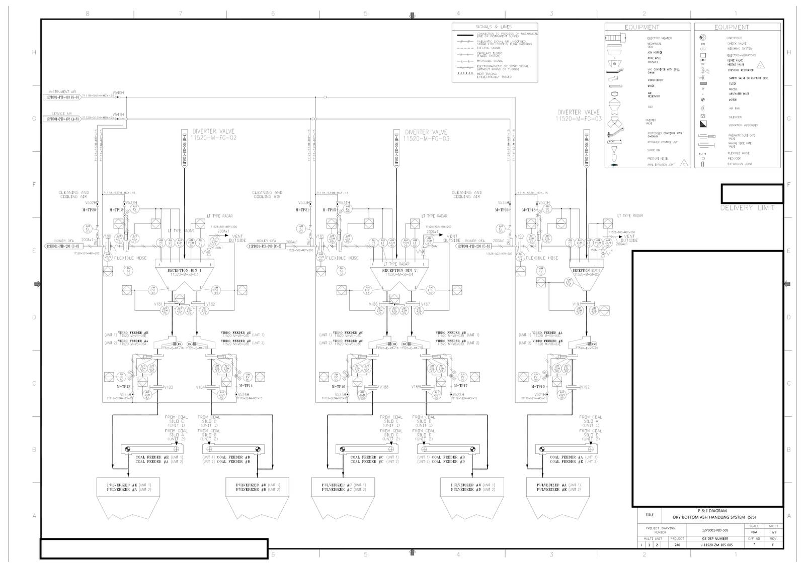
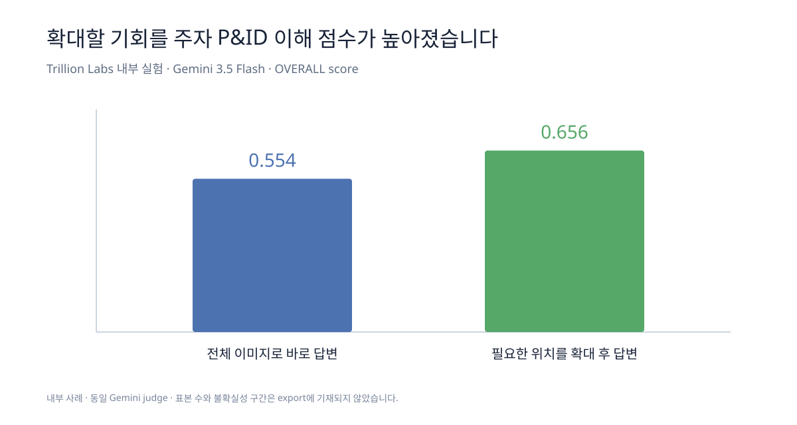

# 이미지 입력 전략: 전체에서 찾고, 필요한 곳을 확대하기

앞 단원에서는 전체를 한눈에 보는 이미지로 위치를 찾고, Feeder #C 주변을 확대해 작은 태그를 확인했습니다.

그렇다면 사람이 매번 정답 구역을 미리 잘라 줘야 할까요? 꼭 그렇지는 않습니다. 모델에게 먼저 전체 도면에서 관련 구역을 찾게 한 뒤, 그 부분을 확대해서 읽을 기회를 줄 수 있습니다. 이 단원에서는 `전체에서 위치 찾기 → 관련 구역 확대 → 확대된 근거로 답하기`라는 이미지 입력 전략을 살펴봅니다.

## 첫 실험에서 발견한 문제

앞 단원에서 본 수동 근거 검토 점수를 필요한 부분만 표로 다시 정리하면 다음과 같습니다.

| 모델 | 전체를 한눈에 보는 이미지 | 부분 확대 이미지 |
|---|---:|---:|
| Claude Sonnet | 3/4 | 4/4 |
| Codex Luna | 2/4 | 4/4 |
| Codex Terra | 2/4 | 4/4 |

Feeder #C 주변 확대 이미지와 같은 짧은 질문을 사용했을 때 세 모델이 모두 4점을 받았습니다.

전체를 한눈에 보는 이미지에서 Sonnet은 Feeder #C의 전동기를 `M-TP16`으로 잘못 읽었습니다. Luna는 Feeder 태그와 전동기 태그를 모두 잘못 읽었고, Terra는 두 태그를 확인하지 못했다고 남겼습니다.

부분 확대 이미지는 `11520-M-SI-04`, `V186`, `11520-M-VB-03C`, `EM / 11520-E-MT-18`과 이들을 잇는 선을 한 화면에 크게 보여 주었습니다. 이번 질문의 정답에 필요한 범위가 이미지 안에 모두 포함되어 있었기 때문에 정확도가 높아졌습니다.

따라서 이번 단원의 출발점은 다음 질문입니다.

> 전체 이미지로 위치를 찾는 능력과 확대 이미지로 작은 글자를 읽는 능력을 한 번의 작업 흐름으로 연결할 수 있을까요?

## Coarse-to-fine은 어떤 방식인가요?

`Coarse-to-fine`은 먼저 전체를 거칠게 보고, 필요한 곳만 자세히 본다는 뜻입니다.

지도 앱을 떠올려보면 쉽습니다. 도시 전체 지도에서는 목적지가 어느 지역에 있는지 확인합니다. 골목까지 확대하면 건물 입구를 찾을 수 있습니다. 그러나 골목 화면만 보면 그 장소가 도시의 어느 지역인지 잊기 쉽습니다. 그래서 필요할 때 다시 축소하여 전체 위치를 확인합니다.

P&ID에서도 같은 순서를 사용합니다.

```text
전체 도면으로 계통과 반복 구조를 확인합니다.
        ↓
질문과 관련된 구역을 선택합니다.
        ↓
확대 이미지에서 작은 글자와 심벌을 확인합니다.
        ↓
확인한 결과를 전체 도면에서 다시 점검합니다.
```

이 순서는 모든 문제에 무조건 적용해야 하는 규칙은 아닙니다. 전체 도면의 제목만 묻는 질문이라면 확대가 필요하지 않습니다. 반대로 작은 태그 하나를 전사하는 질문이라면 처음부터 고해상도 부분 확대 이미지를 사용하는 편이 더 효율적일 수 있습니다.

중요한 것은 질문이 요구하는 정보에 맞추어 이미지의 역할을 정하는 것입니다.

## 1단계: 전체 이미지는 위치 지도로 사용합니다

전체 이미지는 작은 태그를 모두 읽기 위한 입력이 아닙니다. 도면의 신분증과 큰 구조를 확인하기 위한 입력입니다.



전체 이미지에서는 다음을 확인합니다.

- 도면 제목과 revision은 어디에 있습니까?
- 범례는 어디에 있습니까?
- 큰 장비 묶음은 어떻게 반복됩니까?
- 질문과 관련된 장비가 있을 만한 구역은 어디입니까?
- 어느 부분을 확대해야 합니까?

Feeder #C 단일 도면 이해 질문에서는 Reception Bin 아래쪽에 Vibro Feeder가 반복된다는 사실을 먼저 확인합니다. 그러나 `#C`라는 작은 글자를 전체 이미지에서 확정하려고 하지 않습니다.

전체 이미지를 사용할 때에는 다음과 같이 요청할 수 있습니다.

```text
이 이미지는 도면 전체의 위치를 파악하기 위한 이미지입니다.
작은 태그를 추측해서 읽지 말고, Vibro Feeder #C를 확인하려면
어느 구역을 확대해야 하는지 설명해 주세요.
```

## 2단계: 질문과 관련된 구역만 확대합니다

이제 Reception Bin 2 아래쪽에서 Feeder #C가 보이는 부분만 잘라 크게 만듭니다. 이 워크북에서는 이를 `Feeder #C 주변 확대 이미지`라고 부릅니다.


이 확대 이미지에서는 다음 글자를 직접 읽을 수 있습니다.

- `RECEPTION BIN 2`
- `11520-M-SI-04`
- `A`, `V186`
- `VIBRO FEEDER #C`
- `11520-M-VB-03C`
- `11520-E-MT-18`
- 원 안의 `EM`

이제 작은 글자는 보이지만 제목란은 보이지 않습니다. 따라서 이 부분 확대 이미지만 보고 전체 계통 이름이나 현재 도면번호를 새로 판단하면 안 됩니다. 전체 도면에서 이미 확인한 문맥과 연결하여 읽어야 합니다.

## 3단계: 먼저 짧고 검증 가능한 질문을 사용합니다

정답 항목과 이미지 범위가 명확하다면 먼저 짧은 질문으로 실행합니다.

```text
Reception Bin 2의 A측 출구에서 Feeder #C까지 선을 따라가며
Bin 태그, 밸브 번호, Feeder 태그, 전동기 심벌과 태그를 그대로 적어 주세요.
```

이 질문으로 세 모델이 모두 정확히 답했습니다. 단계별 지침은 기본값으로 추가하지 않습니다. 예를 들어 전동기 태그를 오른쪽의 `11520-E-MT-19`와 반복해서 혼동할 때에만 `Feeder #C에 직접 연결된 전동기를 확인하세요` 같은 규칙을 추가합니다.

## 4단계: 전체 도면으로 돌아갑니다

확대 이미지에서 `VIBRO FEEDER #C`를 읽었다면 다시 전체 도면을 확인합니다.

- 이 Feeder는 Reception Bin 2의 A측 출구와 연결되어 있습니까?
- A측 선에 `V186`이 있습니까?
- `11520-E-MT-18`은 Feeder #C 옆의 `EM`에 속합니까?
- 현재 시트의 제목은 Bottom Ash Handling System 5/5입니까?
- 부분 확대 이미지에 보인 도면 간 연결 표시는 현재 도면번호가 아니라 다른 시트를 가리키는 표기입니까?
- 확대 이미지 밖으로 나가는 선은 전체 도면에서 어느 방향으로 이어집니까?

이 과정을 거치면 작은 글자를 읽는 능력과 전체 문맥을 이해하는 능력을 함께 사용할 수 있습니다.

어디를 확대해야 할지 전혀 알 수 없다면 도면을 몇 개의 겹치는 구역으로 나누어 후보를 찾을 수도 있습니다. 다만 네 조각으로 나누는 것 자체가 목적은 아닙니다. 질문과 관련된 위치를 찾았다면 그 구역만 확대하는 편이 더 직접적입니다.

## Trillion Labs에서도 확대 기회를 주었을 때 더 잘했습니다

Trillion Labs의 내부 P&ID 실험에서도 비슷한 패턴이 나타났습니다. 같은 모델에 고해상도 전체 이미지를 주고 바로 답하게 했을 때보다, 먼저 도면을 살펴보고 필요한 위치를 확대할 기회를 주었을 때 전체 점수가 높았습니다.



고해상도 전체 이미지에 바로 답한 조건의 OVERALL score는 `0.554`, 확대 기회를 준 조건은 `0.656`이었습니다. 핵심은 복잡한 분할 규칙이 아니라, 모델이 작은 근거를 읽기 전에 **어디를 자세히 볼지 선택할 수 있었다**는 점입니다.

이 수치는 Trillion Labs 내부 메모에 기록된 사례이며 범용 벤치마크는 아닙니다. 표본 수와 불확실성 구간이 없고 답변 채점에도 같은 Gemini 모델이 사용되었으므로, 정확한 우열보다 이미지 입력 방식이 결과에 영향을 준다는 관찰로 해석합니다.

## 이 단원에서 만든 판단 기준

이제 이미지 입력 전략을 다음과 같이 선택할 수 있습니다.

| 질문 상황 | 먼저 사용할 이미지 | 이유 |
|---|---|---|
| 도면 제목이나 전체 계통을 묻습니다 | 전체 이미지 | 제목란과 전체 문맥이 필요합니다. |
| 작은 장비명이나 태그를 읽습니다 | 고해상도 부분 확대 이미지 | 작은 글자를 크게 보여 줍니다. |
| 연결선이 여러 구역을 지납니다 | 서로 겹치게 만든 확대 이미지와 전체 이미지 | 경계에서 연결이 끊기는 것을 줄입니다. |
| 어떤 곳을 확대할지 모릅니다 | 전체 이미지 또는 겹치는 네 구역 | 후보 위치를 먼저 찾습니다. |
| 기존 답을 검토합니다 | 답의 근거 구역과 전체 이미지 | 세부 근거와 전체 문맥을 함께 확인합니다. |

## 다음 단원으로 넘어갑니다

부분 확대 이미지는 작은 글자를 읽기 쉽게 만들었습니다. 다음 질문은 `도면에 텍스트 검색 기능까지 추가하면 에이전트가 후보 위치를 더 빨리 찾을 수 있는가`입니다.

다음 단원에서는 Tesseract OCR로 검색 가능한 PDF와 위치가 있는 문자 데이터를 만들고, OCR이 실제 에이전트 답변에 어떤 차이를 만드는지 확인합니다.
