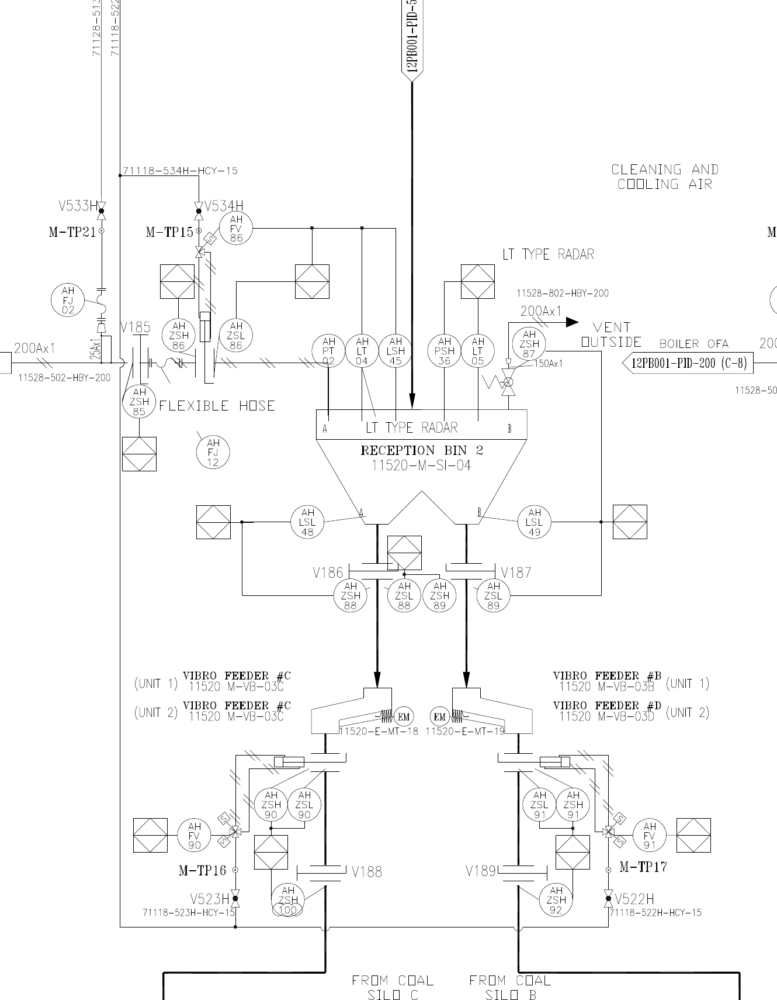
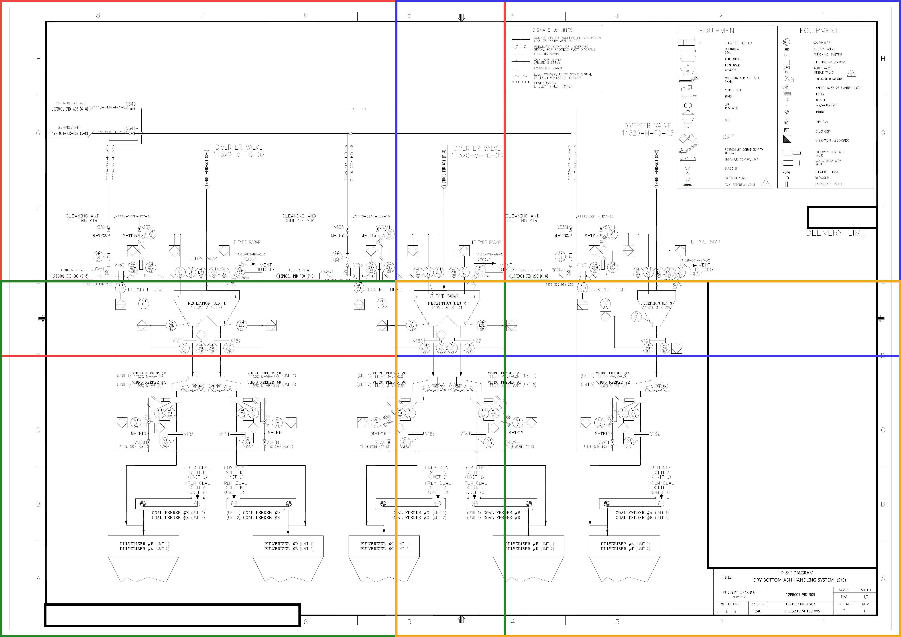
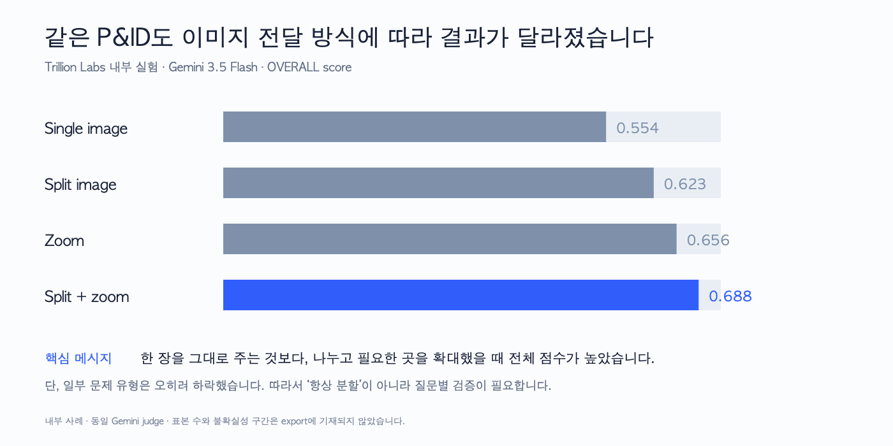

# AI가 큰 P&ID를 읽도록 이미지를 준비하는 방법

앞 단원의 실제 CLI 실험에서는 부분 확대 이미지가 작은 글자를 키워 주었지만, 전체 문맥을 잘라내어 새로운 오류를 만들기도 했습니다. 전체 이미지와 확대 이미지 가운데 하나를 고르는 대신 서로 다른 역할로 연결해야 하는 이유를 살펴보겠습니다.

## 먼저 실제 결과를 다시 봅니다

앞 단원에서 본 수동 근거 검토 점수를 필요한 부분만 표로 다시 정리하면 다음과 같습니다.

| 모델 | 전체+짧은 질문 | 부분 확대+짧은 질문 | 부분 확대+근거 확인 질문 |
|---|---:|---:|---:|
| Claude Sonnet | 3/4 | 3/4 | 3/4 |
| Codex Luna | 4/4 | 3/4 | 3/4 |
| Codex Terra | 3/4 | 2/4 | 3/4 |

가운데 열을 보면 Feeder #C 주변 확대 이미지가 모든 모델의 점수를 높이지는 않았습니다. Luna와 Terra의 점수는 전체 이미지보다 낮아졌습니다.

세 모델은 확대 이미지에서 `VIBRO FEEDER #C`와 Reception Bin 2를 잘 찾았습니다. 그러나 아래쪽의 `FROM COAL SILO C` 표기를 Feeder 출구가 향하는 방향처럼 설명하거나, 인접 태그를 Feeder #C 태그와 섞어 읽는 오류가 나타났습니다.

부분 확대는 작은 글자를 크게 만들어 주었습니다. 그러나 연결선의 시작과 끝이 이미지 밖으로 잘렸기 때문에 흐름 방향을 과도하게 해석하기 쉬워졌습니다.

오른쪽 열에서는 같은 부분 확대 이미지에 근거 확인 순서를 추가했습니다. Motor와 joint 구분은 좋아졌지만 아래쪽 연결 방향 오류와 Terra의 태그 오독은 완전히 해결되지 않았습니다.

따라서 이번 단원의 출발점은 다음 두 문장입니다.

> 부분 확대 이미지는 확대경과 같습니다. 글자를 키워 주지만 주변 풍경을 대신 보여 주지는 않습니다.

> 좋은 프롬프트는 확대경으로 무엇을 확인하고, 무엇은 확인하지 못했다고 남길지 알려 줍니다.

## Coarse-to-fine은 어떤 방식인가요?

`Coarse-to-fine`은 먼저 전체를 거칠게 보고, 필요한 곳만 자세히 본다는 뜻입니다.

지도 앱을 떠올려보면 쉽습니다. 도시 전체 지도에서는 목적지가 어느 지역에 있는지 확인합니다. 골목까지 확대하면 건물 입구를 찾을 수 있습니다. 그러나 골목 화면만 보면 그 장소가 도시의 어느 지역인지 잊기 쉽습니다. 그래서 필요할 때 다시 축소하여 전체 위치를 확인합니다.

P&ID에서도 같은 순서를 사용합니다.

```text
전체 도면으로 계통과 반복 구조를 확인합니다.
        ↓
질문과 관련된 구역을 선택합니다.
        ↓
확대 이미지에서 작은 글자와 심벌을 확인합니다.
        ↓
확인한 결과를 전체 도면에서 다시 점검합니다.
```

이 순서는 모든 문제에 무조건 적용해야 하는 규칙은 아닙니다. 전체 도면의 제목만 묻는 질문이라면 확대가 필요하지 않습니다. 반대로 작은 태그 하나를 전사하는 질문이라면 처음부터 고해상도 부분 확대 이미지를 사용하는 편이 더 효율적일 수 있습니다.

중요한 것은 질문이 요구하는 정보에 맞추어 이미지의 역할을 정하는 것입니다.

## 1단계: 전체 이미지는 위치 지도로 사용합니다

전체 이미지는 작은 태그를 모두 읽기 위한 입력이 아닙니다. 도면의 신분증과 큰 구조를 확인하기 위한 입력입니다.


전체 이미지에서는 다음을 확인합니다.

- 도면 제목과 revision은 어디에 있습니까?
- 범례는 어디에 있습니까?
- 큰 장비 묶음은 어떻게 반복됩니까?
- 질문과 관련된 장비가 있을 만한 구역은 어디입니까?
- 어느 부분을 확대해야 합니까?

Feeder #C 단일 도면 이해 질문에서는 Reception Bin 아래쪽에 Vibro Feeder가 반복된다는 사실을 먼저 확인합니다. 그러나 `#C`라는 작은 글자를 전체 이미지에서 확정하려고 하지 않습니다.

전체 이미지를 사용할 때에는 다음과 같이 요청할 수 있습니다.

```text
이 이미지는 도면 전체의 위치를 파악하기 위한 이미지입니다.
작은 태그를 추측해서 읽지 말고, Vibro Feeder #C를 확인하려면
어느 구역을 확대해야 하는지 설명해 주세요.
```

## 2단계: 질문과 관련된 구역만 확대합니다

이제 Reception Bin 2 아래쪽에서 Feeder #C가 보이는 부분만 잘라 크게 만듭니다. 이 워크북에서는 이를 `Feeder #C 주변 확대 이미지`라고 부릅니다.



이 확대 이미지에서는 다음 글자를 직접 읽을 수 있습니다.

- `VIBRO FEEDER #C`
- `11520-M-VB-03C`
- `11520-E-MT-18`
- 원 안의 `EM`

이제 작은 글자는 보이지만 제목란은 보이지 않습니다. 따라서 이 부분 확대 이미지만 보고 전체 계통 이름이나 현재 도면번호를 새로 판단하면 안 됩니다. 전체 도면에서 이미 확인한 문맥과 연결하여 읽어야 합니다.

## 3단계: 한 번에 하나의 판단을 요청합니다

확대 이미지 한 장에 장비, 모든 계기, 연결 관계와 고장 원인을 한꺼번에 물으면 어떤 근거에서 오류가 생겼는지 알기 어렵습니다.

Feeder #C를 깊게 읽을 때에는 다음처럼 질문을 나누어 확인합니다.

### 먼저 장비명과 태그를 확인합니다

```text
이미지에서 VIBRO FEEDER #C와 11520-M-VB-03C가 보이는지 확인해 주세요.
보이는 문자열을 그대로 적고, 읽히지 않는 문자는 확인하지 못함으로 남겨 주세요.
```

### 그다음 motor와 joint 근거를 구분합니다

```text
Feeder 주변의 E-MT와 EM 표기가 무엇을 가리키는지 확인해 주세요.
Motor 근거와 Expansion Joint 근거를 분리하고,
이미지만으로 확정할 수 없는 설비 요소의 의미는 확인하지 못함으로 남겨 주세요.
```

### 마지막으로 기존 결과만 검토합니다

```text
새로운 장비나 태그를 추가하지 말고,
앞에서 작성한 결과가 이미지에서 실제로 확인되는지만 다시 검토해 주세요.
```

이렇게 질문을 나누면 `태그는 맞았지만 설비 요소 해석이 틀렸습니다`처럼 오류가 발생한 단계를 찾을 수 있습니다.

## 4단계: 전체 도면으로 돌아갑니다

확대 이미지에서 `VIBRO FEEDER #C`를 읽었다면 다시 전체 도면을 확인합니다.

- 이 Feeder는 Reception Bin 2 아래에 있습니까?
- 현재 시트의 제목은 Bottom Ash Handling System 5/5입니까?
- 부분 확대 이미지에 보인 도면 간 연결 표시는 현재 도면번호가 아니라 다른 시트를 가리키는 표기입니까?
- 확대 이미지 밖으로 나가는 선은 전체 도면에서 어느 방향으로 이어집니까?

이 과정을 거치면 작은 글자를 읽는 능력과 전체 문맥을 이해하는 능력을 함께 사용할 수 있습니다.

## 도면을 네 조각으로 나누는 방법은 언제 사용하나요?

어떤 구역을 확대해야 할지 아직 모를 때에는 전체 도면을 네 개의 큰 구역으로 나누어 볼 수 있습니다.



구역을 정확히 반으로만 자르면 경계에 있는 장비와 선이 잘릴 수 있습니다. 그래서 이 워크북의 사분면 이미지는 이웃 구역과 일부 겹치도록 만들었습니다.

그러나 질문의 장비가 어느 반복 구조에 있을지 추정할 수 있다면, 기계적으로 네 조각을 모두 보는 것보다 질문에 필요한 장비 주변만 부분 확대하는 편이 더 직접적입니다.

## Trillion Labs 내부 사례에서는 어떤 차이가 있었나요?

Trillion Labs에서는 P&ID 이해 작업에 같은 모델을 사용하면서 이미지를 전달하는 방식을 바꾸어 비교했습니다.



각 방식은 다음을 의미합니다.

- `Single image`는 전체 P&ID 한 장만 제공합니다.
- `Split image`는 전체 이미지와 네 개의 분할 이미지를 함께 제공합니다.
- `Zoom`은 에이전트가 필요한 위치를 선택하여 확대할 수 있게 합니다.
- `Split + zoom`은 분할 이미지로 후보 구역을 보고, 필요한 곳을 다시 확대할 수 있게 합니다.

기록된 OVERALL score는 Single 0.554, Split 0.623, Zoom 0.656, Split+zoom 0.688이었습니다.

이 결과가 `항상 이미지를 나누어야 합니다`라는 뜻은 아닙니다. 세부 문제 유형을 보면 material과 multihop에서는 split+zoom이 single-highres보다 낮았습니다.

이 사례가 전달하는 메시지는 다음과 같습니다.

> AI에게 같은 P&ID를 전달했다고 말하려면 파일만 같아서는 부족합니다. 실제로 모델이 본 축소 크기, 분할 방식, 확대 도구와 최종 문맥까지 기록해야 합니다.

이 수치는 제공된 Trillion Labs 내부 메모를 바탕으로 합니다. 답변을 채점한 모델도 같은 Gemini 모델이며, 원본 메모에는 편향 가능성이 기록되어 있습니다. 내보낸 자료에는 표본 수와 불확실성 구간이 포함되어 있지 않으므로 독립적인 범용 평가 결과가 아니라 이미지 입력 설계의 중요성을 보여 주는 내부 사례로 해석합니다.

## 이미지 크기를 비용으로 바꾸어 봅니다

픽셀 수만으로 실제 비용을 계산할 수는 없습니다. 서비스가 이미지를 내부적으로 축소하고 visual token으로 변환하기 때문입니다. 다만 공식 계산 규칙을 사용하면 이미지 한 장의 API 입력 비용을 추정할 수 있습니다.

Claude는 28×28 픽셀 패치를 visual token으로 계산합니다. 모델별 해상도 한도를 적용한 뒤 token 수에 모델의 입력 단가를 곱합니다. Claude 공식 문서는 이 계산 방식과 해상도별 token 예시를 제공합니다. [Claude vision 문서](https://platform.claude.com/docs/en/build-with-claude/vision)

OpenAI GPT-5.6 계열은 32×32 픽셀 patch 수에 모델 배수 1.2를 적용합니다. Detail 설정에 따라 이미지 크기 제한이 달라집니다. [OpenAI 이미지 입력 비용 계산](https://developers.openai.com/api/docs/guides/images-vision#calculating-costs)

전체 구조용 이미지와 Feeder #C 주변 확대 이미지를 공식 규칙으로 계산하면 다음과 같습니다.

| 모델 | 전체 구조용 이미지 비용 | Feeder #C 주변 확대 이미지 비용 |
|---|---:|---:|
| Claude Sonnet 5 | 약 $0.00476 | 약 $0.00595 |
| Claude Opus 5 | 약 $0.01189 | 약 $0.01488 |
| GPT-5.6 Luna | 약 $0.00043 | 약 $0.00054 |
| GPT-5.6 Terra | 약 $0.00432 | 약 $0.00544 |
| GPT-5.6 Sol | 약 $0.00864 | 약 $0.01089 |

이 표는 이미지 한 장의 API 입력에 해당하는 추정 비용입니다. 프롬프트, 시스템 지침, tool schema, 대화 기록, reasoning과 출력 token 비용은 포함하지 않습니다.

부분 확대 이미지의 픽셀 면적은 전체 원본보다 작지만, 세로로 긴 Feeder #C 주변 이미지는 모델의 patch 계산에서 전체 구조용 이미지보다 더 많은 token을 사용할 수 있습니다. 따라서 부분 확대는 항상 비용을 줄이는 방법이 아닙니다. 첫 번째 목적은 필요한 글자를 읽을 수 있게 만드는 것입니다.

## 실제 CLI 실행의 비용은 왜 더 큰가요?

새 단일 도면 이해 실험에서 Claude Code Sonnet이 보고한 전체 비용은 실행당 약 $0.058~$0.100이었습니다. 이 값에는 이미지뿐 아니라 Claude Code의 시스템 지침, 파일 읽기 도구, cache 작성과 읽기, 추론과 출력 token이 포함됩니다.

Codex CLI는 이번 JSONL 출력에 달러 비용을 직접 기록하지 않았습니다. 따라서 Luna와 Terra는 CLI가 보고한 input, cached input, output token에 공식 API 단가를 적용한 등가 추정값을 별도로 계산해야 합니다.

또한 CLI가 구독 계정으로 실행되었다면 API 정가 추정치가 실제 청구 금액을 뜻하지 않을 수 있습니다. 워크북에서는 다음 두 값을 구분합니다.

- `CLI 보고 사용량과 비용`: CLI가 직접 보고한 값입니다.
- `API 등가 추정값`: 공식 API token 단가로 환산한 비교용 추정값입니다.

재현 가능한 계산 결과는 `data/image-cost-estimates.csv`에 있으며 계산 스크립트는 `scripts/calculate_image_costs.py`입니다.

## 이 단원에서 만든 판단 기준

이제 이미지 입력 전략을 다음과 같이 선택할 수 있습니다.

| 질문 상황 | 먼저 사용할 이미지 | 이유 |
|---|---|---|
| 도면 제목이나 전체 계통을 묻습니다 | 전체 이미지 | 제목란과 전체 문맥이 필요합니다. |
| 작은 장비명이나 태그를 읽습니다 | 고해상도 부분 확대 이미지 | 작은 글자를 크게 보여 줍니다. |
| 연결선이 여러 구역을 지납니다 | 서로 겹치게 만든 확대 이미지와 전체 이미지 | 경계에서 연결이 끊기는 것을 줄입니다. |
| 어떤 곳을 확대할지 모릅니다 | 전체 이미지 또는 겹치는 네 구역 | 후보 위치를 먼저 찾습니다. |
| 기존 답을 검토합니다 | 답의 근거 구역과 전체 이미지 | 세부 근거와 전체 문맥을 함께 확인합니다. |

## 다음 단원으로 넘어갑니다

AI가 Feeder #C를 찾았다고 답했습니다. 이제 남은 질문은 `그 근거가 정확히 어디에 있었는가`입니다.

답이 대화문으로만 남아 있으면 다른 사람이 같은 위치를 다시 찾기 어렵습니다. 다음 단원에서는 AI의 답과 원본 이미지를 연결하는 `위치 상자`를 알아봅니다.

컴퓨터 비전에서는 이를 bounding box 또는 bbox라고 부릅니다. 다음 단원에서도 용어부터 외우지 않습니다. Feeder #C 답변에 원본 위치가 필요한 이유부터 살펴보겠습니다.
