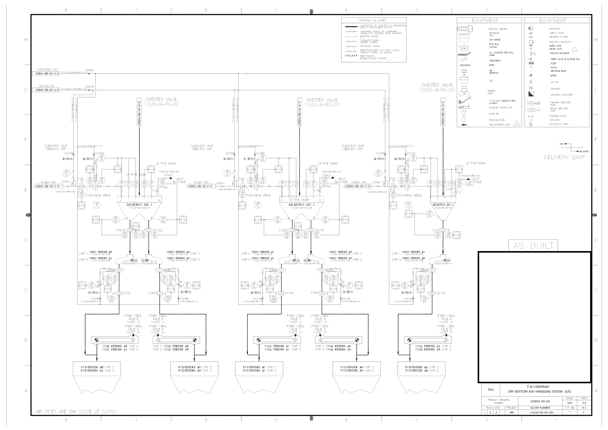
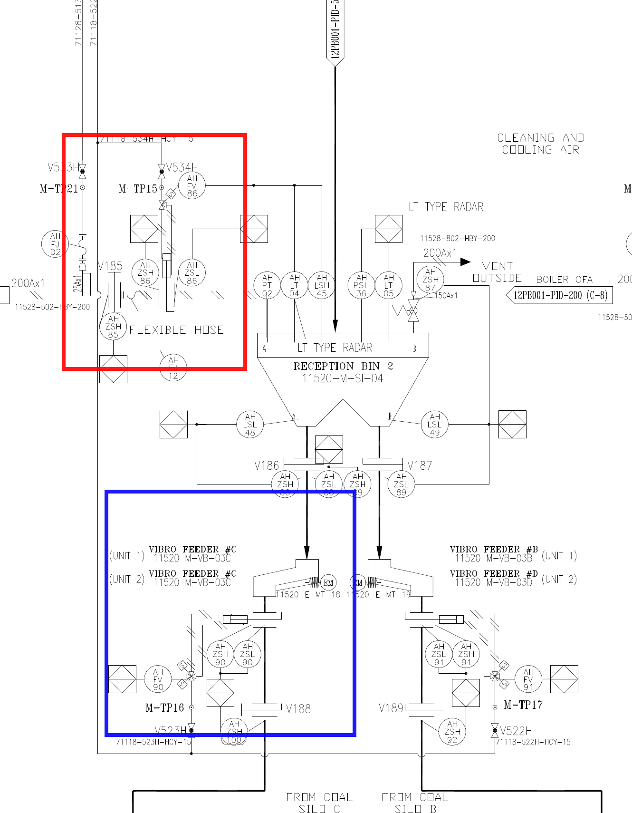

# 60분 따라 하기: AI에게 큰 P&ID 읽히기

## 오늘 하는 일

선택된 P&ID 한 장에서 Vibro Feeder #C의 태그와 연결을 읽는 질문을 같은 AI에게 두 가지 방식으로 맡깁니다.

1. 전체 도면에서 장비와 연결을 읽게 합니다.
2. Feeder #C 주변 확대 → 위치 근거 → 재검증 순서로 읽게 합니다.

두 결과 중 어느 쪽이 원본에서 확인하기 쉬운지 비교합니다.

## 시작 전 확인

- [ ] Claude 또는 Codex 대화창을 열었습니다.
- [ ] 이 안내서와 `MY-WORK.md`를 나란히 열었습니다.
- [ ] `inputs/` 폴더에 PNG 파일이 보입니다.

모델이나 메뉴 이름이 조금 달라도 괜찮습니다. 이미지를 첨부하고 프롬프트를 보내고 결과를 기록할 수 있으면 됩니다.

---

## 1단계: P&ID에서 큰 것만 찾기

먼저 `inputs/01-overview.png`를 눈으로 봅니다.



다음 세 곳을 찾아 손가락이나 커서로 가리켜 봅니다.

- 오른쪽 아래 제목란
- 오른쪽 위 범례
- 중앙의 반복되는 Reception Bin 세 개

작은 원 안의 문자와 숫자는 지금 읽지 않습니다.

`MY-WORK.md`의 1단계에 찾은 위치를 체크합니다.

---

## 2단계: 전체 도면에서 Feeder #C 읽기

`대화 A - baseline`이라는 새 대화를 시작합니다. `inputs/01-overview.png`를 첨부하고 아래 문장을 그대로 보냅니다.

```text
이 P&ID에서 Vibro Feeder #C를 찾아 주세요.

장비 태그, 바로 위쪽에 연결된 장비, 아래쪽 출구 연결,
Expansion Joint와 관련하여 이미지에서 확인되는 내용과
현재 이미지로 확인할 수 없는 내용을 설명해 주세요.
```

응답을 고치거나 다시 질문하지 않습니다. `MY-WORK.md`의 2단계 표에 예/아니오/모름을 표시합니다.

이 결과는 개선 전 기준 결과입니다. 전체 도면에서 작은 태그와 연결을 얼마나 읽을 수 있는지 확인합니다.

---

## 3단계: 전체 도면에서 확대할 위치 찾기

`대화 B - 단계별 읽기`라는 새 대화를 시작합니다. baseline 대화의 영향을 받지 않도록 대화를 분리합니다. `inputs/01-overview.png`를 첨부하고 아래 문장을 보냅니다.

```text
이 이미지는 도면 전체 구조를 확인하기 위한 이미지입니다.
작은 태그를 추측해서 읽지 말고,
Vibro Feeder #C의 태그와 위·아래 연결을 확인하려면
어느 부분을 확대해야 하는지 설명해 주세요.
```

결과에서 다음 표현을 찾습니다.

- 오른쪽 아래, 오른쪽 위, 중앙 같은 위치 표현
- 반복되는 Reception Bin 구조와 Feeder 후보
- #C와 출구 연결을 확인하기 위한 확대 위치
- 작은 태그를 확정하지 않는 태도

`MY-WORK.md`의 3단계에 baseline과 달라진 점 한 가지를 적습니다.

### 중간 사례: 같은 한 장도 어떻게 주느냐가 중요하다

Trillion Labs의 P&ID 내부 실험에서는 같은 모델과 task에서도 이미지 입력 방식에 따라 OVERALL score가 달랐습니다.


- Single high-res: 0.554
- Split low-res: 0.623
- Split+zoom: 0.688
- Zoom low-res: 0.696

더 많은 픽셀을 사용한 tilezoom이 split+zoom보다 낮았고, material·multihop 유형에서는 split+zoom이 single보다 낮았습니다.

따라서 결론은 `항상 잘라라`가 아닙니다.

> 어떤 질문에 어떤 이미지 표현이 적합한지 실제 benchmark로 확인해야 합니다.

이 수치는 내부 사례이며 동일 모델 judge, 표본 수 미기재 등의 한계가 있습니다.

---

## 4단계: Feeder #C 주변 확대 이미지에서 장비와 연결 확인하기

`대화 B - 단계별 읽기`를 계속 사용하고 `inputs/02-feeder-c-area.png`를 첨부합니다.


아래 문장을 그대로 보냅니다.

```text
이 이미지는 전체 도면에서 Reception Bin 2와 Vibro Feeder #C 주변만 잘라 크게 만든 확대 이미지입니다.

다음 순서로 확인해 주세요.
1. VIBRO FEEDER #C와 11520-M-VB-03C를 읽습니다.
2. Feeder 바로 위쪽에 연결된 장비를 선을 따라 확인합니다.
3. Feeder 아래쪽 출구에서 보이는 선과 설비를 확인합니다.
4. E-MT/EM 표기는 motor 근거와 joint 근거로 나누어 검토합니다.
5. 확인하지 못한 내용은 추측하지 않습니다.
```

왜 연결을 위쪽과 아래쪽으로 나누어 확인하는지 생각합니다. 글자를 읽는 것과 연결 방향을 해석하는 것은 서로 다른 작업이기 때문입니다.

`MY-WORK.md`의 4단계 표에 첫 번째 장비 후보 하나만 옮겨 적습니다.

---

## 5단계: 질문의 근거 위치를 확인하기

AI가 `VIBRO FEEDER #C가 보인다`고 말해도 문장만으로는 어느 위치에서 읽었는지 다시 확인하기 어렵습니다. 이제 답에 원본 위치 주소를 붙입니다.

`inputs/03-query-evidence.png`를 엽니다.



파란 상자에서 `VIBRO FEEDER #C`, 장비 태그와 아래쪽 연결 문맥을 확인합니다. 빨간 상자는 다른 질문에서 Flexible Hose와 OFA 연결을 확인할 때 사용하는 구역입니다.

이 사각형을 `위치 상자`라고 합니다. 컴퓨터 비전에서는 bounding box, 줄여서 bbox라고 부릅니다.

파란 근거 구역의 확대 이미지 내부 좌표는 다음과 같습니다.

```text
왼쪽 위: (220, 1030)
오른쪽 아래: (750, 1550)
위치 상자: [220, 1030, 750, 1550]
```

좌표를 직접 측정할 필요는 없습니다. 지금은 이 네 숫자가 파란 상자를 파일에 저장하는 방법이라는 것만 이해합니다.

이 위치 주소가 있으면 다음 작업을 할 수 있습니다.

- 다른 사람이 같은 위치에서 AI 답을 검토
- 같은 구역을 다시 확대
- 질문의 단서와 설비 요소 의미를 같은 근거 구역에서 재검토

## 6단계: 도면 이해 결과를 구조화된 행으로 만들기

지금까지 AI는 문장으로 답했습니다. 문장은 읽기 좋지만 여러 결과를 검색하고 비교하기 어렵습니다. 이제 같은 정보를 정해진 열에 넣어 `다시 사용할 수 있는 한 행`으로 바꿉니다.

예를 들어 다음 작업이 가능해집니다.

- 검토가 필요한 행만 모으기
- Claude와 Codex가 다르게 읽은 열 찾기
- 저장된 위치 상자로 같은 구역 다시 확대하기
- Claude Code와 Codex가 같은 질문 단서를 확인했는지 비교하기

JSON을 작성하는 것이 목적은 아닙니다. 이번 단계에서는 표 한 행이면 충분합니다.

`대화 B - 단계별 읽기`를 계속 사용하고 `inputs/03-query-evidence.png`를 첨부한 뒤 아래 문장을 보냅니다.

```text
파란 근거 구역 [220,1030,750,1550]을 검토해 주세요.

다음 열을 가진 표로 작성해 주세요:
- 질문에서 확인할 단서
- 이미지에서 직접 읽은 글자나 심벌
- 해석한 설비 요소
- 근거 위치
- 확인 상태
- 검토 메모

읽히지 않는 값은 `확인하지 못함`으로 두고 추측하지 마세요.
마지막에 motor 근거와 joint 근거를 혼동하지 않았는지 확인해 주세요.
```

결과를 `MY-WORK.md`의 6단계에 붙여 넣습니다.

이 프롬프트에서 다음 다섯 요소에 밑줄을 그어 봅니다.

- 목표
- 입력 또는 대상 위치
- 규칙
- 출력 형식
- 완료 전 검사

---

## 7단계: 새로 분석하지 말고 검토만 시키기

아래 문장을 보냅니다.

```text
새 객체나 태그를 추가하지 마.
방금 만든 Feeder #C 근거 행만 같은 이미지에서 다시 확인해 주세요.

확인됨 / 수정 필요 / 판독 불가 중 하나로 판정하고,
어떤 글자·심벌과 어떤 위치를 근거로 삼았는지 적어 주세요.
```

AI의 판정을 그대로 믿지 않습니다. 본인도 파란 상자의 글자와 심벌을 다시 보고 `MY-WORK.md`에 최종 판정을 적습니다.

---

## 8단계: 단일 도면 이해 결과를 평가하기

직접 실행한 결과 또는 강사가 준비한 결과를 다음 기준으로 채점합니다.

| 영역 | 질문 | 점수 |
|---|---|---:|
| 장비 식별 | VIBRO FEEDER #C와 태그를 정확히 읽었습니까? | 0~1 |
| 위쪽 연결 | Reception Bin 2와의 연결을 확인했습니까? | 0~1 |
| 아래쪽 연결 | 보이는 선과 흐름 해석을 구분했습니까? | 0~1 |
| 설비 요소 해석 | Motor와 Expansion Joint 근거를 구분했습니까? | 0~1 |

실행 시간, 도구 호출과 token은 4점에 더하지 않습니다. 품질 점수가 비슷할 때 효율을 비교합니다.

## 9단계: 오류 하나만 개선하기

가장 큰 오류 하나를 고르고 원인을 분류합니다.

```text
데이터 준비 / 후보 검색 / agent 지침 / 도구 / 스키마 / 평가 / 모델 한계
```

그 다음 한 가지만 바꿉니다.

```text
오류: E-MT-18을 expansion joint로 오인
변경: 스킬에 E-MT/EM은 motor evidence라는 구분 추가
```

새 대화에서 동일한 단일 도면 이해 질문을 다시 실행합니다. 모델, 질문과 원본 데이터는 바꾸지 않습니다. 수업 중 실행 시간이 부족하면 강사가 준비한 개선 후 결과를 사용합니다.

## 10단계: Claude Code와 Codex 비교하기

두 제품의 문장 스타일이 아니라 같은 업무 조건을 얼마나 만족했는지 비교합니다.

- 장비 태그 정확성
- 위·아래 연결 설명의 정확성
- Motor와 joint 구분
- 적절하게 확인을 보류한 항목
- 실행 시간, 도구 호출, token과 비용

모델명, effort, available tools와 skill load mode가 다르면 함께 기록합니다.

## 11단계: 회고

다음 문장을 완성합니다.

```text
전체 도면에서는 ____________________만 먼저 본다.
작은 글자는 ____________________에서 본다.
AI 결과를 믿기 전에 ____________________를 원본에서 다시 확인합니다.
이번 개선 Loop에서 바꾼 한 가지는 ____________________입니다.
```

이것으로 `도면 읽기 → 평가 → 개선 → 재평가`의 한 Loop가 끝났습니다.

## 더 진행하고 싶다면

OCR text layer, 두 번째 현업 질문 Q008, 네 구역 분할과 스킬 전후 비교는 [선택 확장 실습](EXTENSIONS.md)에 분리했습니다. 핵심 실습을 마친 뒤 필요한 활동만 선택해 주세요.

## 막혔을 때

| 문제 | 바로 할 일 |
|---|---|
| 이미지 첨부가 안 됨 | 강사가 화면에 이미지를 띄우고 프롬프트만 실행 |
| 응답이 너무 늦음 | 준비 응답을 받아 7단계 검토부터 진행 |
| 작은 글자가 안 보임 | 브라우저 확대가 아니라 `02-feeder-c-area.png` 원본을 열기 |
| 위치 좌표가 어려움 | 숫자는 건너뛰고 파란 근거 구역만 확인 |
| JSON이 어려움 | JSON을 사용하지 않고 표 한 행으로 기록 |
