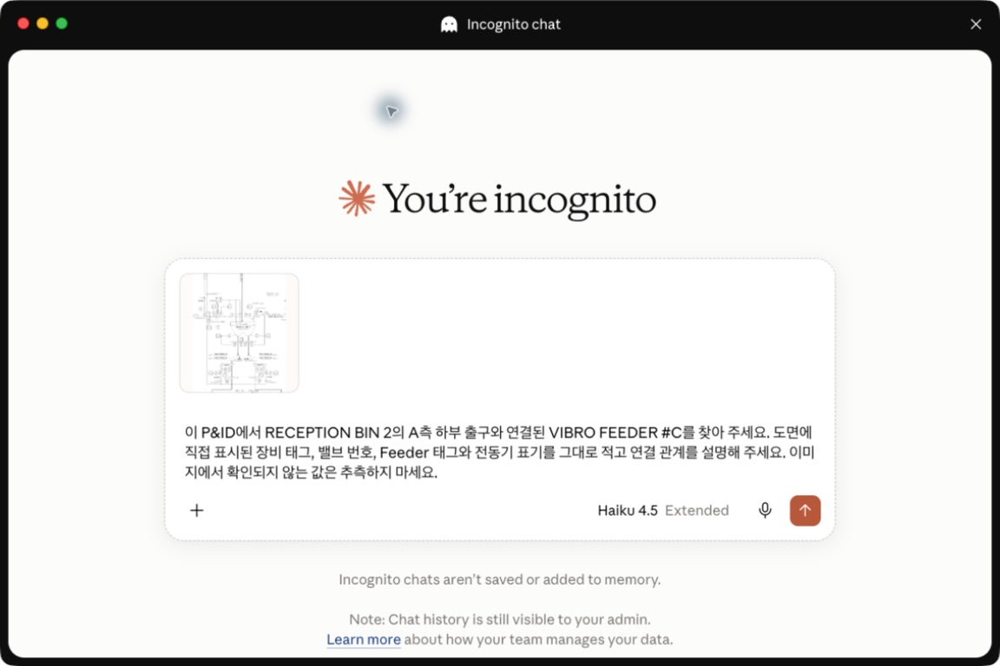
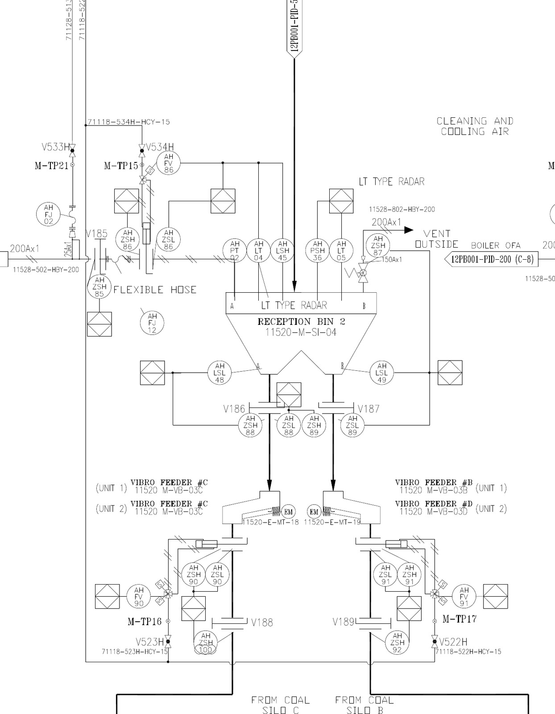

# 이미지 확대와 프롬프트 비교 실험

앞 단원에서는 Reception Bin 2의 A측 출구에서 선을 따라 Feeder #C와 전동기까지 확인했습니다. 이번 실습에서는 Claude Haiku 또는 Codex Luna에 같은 작업을 맡깁니다. 본문에 남아 있는 Sonnet과 Terra 점수는 이전에 수행한 비교 실험의 기록입니다.

처음에는 도면 전체를 한눈에 볼 수 있도록 축소한 이미지를 보여 줍니다. 모델이 작은 태그를 제대로 읽지 못하면 질문과 관련된 부분만 확대하여 같은 질문을 다시 전달합니다.

이 실험에서는 모델 순위보다 이미지 범위가 판독에 미치는 영향을 살펴봅니다. 전체 이미지로 위치를 찾고, 작은 글자가 필요할 때 원본의 관련 구역을 확대하는 과정을 직접 확인합니다.

<div class="lesson-summary">
  <p class="lesson-summary__label">이 단원에서 할 일</p>
  <ul>
    <li>전체 이미지와 부분 확대 이미지를 같은 질문으로 비교합니다.</li>
    <li>모델 답변의 네 항목을 기준 답안으로 직접 채점합니다.</li>
  </ul>
  <p class="lesson-summary__outcome"><strong>완료 기준:</strong> 이미지 범위가 작은 태그 판독에 미치는 영향을 설명할 수 있습니다.</p>
</div>

## 답이 명확한 질문을 사용합니다

세 모델에 다음 질문을 동일하게 전달했습니다.

> 이 P&ID에서 `RECEPTION BIN 2`의 A측 하부 출구와 연결된 `VIBRO FEEDER #C`를 찾아 주세요. 도면에 직접 표시된 ① Reception Bin 2의 장비 태그, ② A측 하부 출구의 밸브 번호, ③ Vibro Feeder #C의 장비 태그, ④ Feeder #C에 연결된 전동기의 심벌 표기와 태그를 그대로 적고 연결 관계를 설명해 주세요. 이미지에서 확인되지 않는 값은 추측하지 마세요.

이 질문은 네 항목의 문자열이 맞는지 각각 확인할 수 있습니다. 고장 원인이나 심벌 의미처럼 해석에 따라 달라질 수 있는 항목은 평가 대상에서 제외했습니다.

## 먼저 기준 답안을 확인합니다

실행 결과를 비교하기 전에 원본 도면에서 확인한 정답을 준비합니다. 각 항목의 문자열을 모두 정확히 읽으면 1점입니다.

| 평가 항목 | 기준 답안 |
|---|---|
| Reception Bin 2 장비 태그 | `11520-M-SI-04` |
| A측 하부 출구 밸브 | `V186` |
| Vibro Feeder #C 장비 태그 | Unit 1과 Unit 2 모두 `11520-M-VB-03C` |
| Feeder #C 전동기 | 원 안의 `EM`, 태그 `11520-E-MT-18` |

오른쪽의 `11520-E-MT-19`는 다른 Feeder에 연결된 전동기이므로 Feeder #C의 답에서 제외합니다. 일부 문자만 맞거나 잘못된 값을 함께 적으면 해당 항목은 0점으로 처리합니다.

이 표를 옆에 두고 각 실행 결과가 4점 만점에 몇 점인지 먼저 직접 채점해 보세요.

## 이제 Desktop 앱에서 직접 실행해 봅니다

이 실습의 기본 경로는 긴 셸 명령이나 실행 스크립트가 아니라 **새 대화에 이미지를 직접 첨부하고 질문을 붙여 넣는 방식**입니다. Codex 또는 Claude Desktop 중 현재 사용할 수 있는 앱 하나만 선택하면 됩니다.

실험 사이에는 다음 세 조건을 지킵니다.

1. 매번 새 대화를 시작합니다.
2. 같은 모델을 유지합니다.
3. 질문은 그대로 두고 이미지만 바꿉니다.

먼저 `실습자료/이미지/전체-도면.png`를 첨부합니다. Claude Code에서는 입력창에 `@실습자료/이미지/전체-도면.png`를 입력해 파일을 선택할 수도 있습니다. 그다음 `실습자료/프롬프트/기본-질문.txt`의 질문을 복사해 붙여 넣습니다.

답변을 받은 뒤 네 항목을 채점합니다. 다음 실행에서는 **새 대화**를 열고 질문과 모델은 그대로 유지한 채 이미지만 `실습자료/이미지/feeder-c-확대.png`로 바꿉니다.



화면처럼 첨부한 이미지의 미리보기, 질문과 선택 모델을 전송 전에 함께 확인합니다. 모델 이름은 계정과 앱 버전에 따라 다르게 보일 수 있지만, 이 실습에서는 Haiku를 권장합니다.

> **처음부터 4/4가 나왔나요?**
>
> 정상적인 결과입니다. 모델 버전과 실행 시점에 따라 한 장짜리 예제의 값을 처음부터 모두 읽을 수 있습니다. 이 경우에도 확대 전후의 근거 위치, 연결 설명, 추측 여부가 달라졌는지 비교해 보세요. 이 실습의 성공 기준은 특정 오답을 재현하는 것이 아니라 이미지 범위가 답변의 정확성과 검증 가능성에 미치는 영향을 설명하는 것입니다.

Codex 실습에서는 GPT-5.6 Luna, Claude 실습에서는 Haiku를 권장합니다. 다른 모델을 사용해도 되지만 세 조건을 비교하는 동안에는 같은 모델을 유지하세요.

## 실험 1: 전체를 한눈에 보는 이미지로 시작합니다

도면 제목, 범례와 전체 연결이 한 화면에 보이는 이미지를 제공합니다. Reception Bin 2가 어느 부분에 있는지는 알 수 있지만 작은 태그는 매우 작게 보입니다.

Desktop 기본 경로에서는 위에서 첨부한 전체 도면의 답변을 사용합니다. CLI로 조건을 고정하고 결과를 파일로 남기고 싶을 때만 아래 재현 경로를 펼칩니다.

<details class="practice-result">
  <summary>선택: 실험 1을 CLI로 재현하기</summary>
  <div class="practice-result__body">

처음 사용한다면 `codex --version` 또는 `claude --version`으로 설치와 로그인을 먼저 확인하세요. 아래 Codex나 Claude Code 명령 중 하나를 실행하고 네 항목 가운데 몇 개를 정확히 읽었는지 셉니다.

### Codex로 실행

```bash
# 세 실험의 결과를 모을 폴더를 먼저 만듭니다.
mkdir -p output/첫-실험

# GPT-5.6 Terra 등 다른 Codex 모델을 쓰려면 아래 --model 값을 바꿉니다.
# GPT-5.6 Luna에 전체 도면과 기본 질문을 전달합니다.
codex exec \
  --model gpt-5.6-luna \
  --image 실습자료/이미지/전체-도면.png \
  --sandbox read-only \
  --ephemeral \
  -C "$PWD" \
  --output-last-message output/첫-실험/1-codex-luna-전체-기본.txt \
  "$(<실습자료/프롬프트/기본-질문.txt)"
```

위 명령을 앞에서부터 하나씩 읽어 보면 다음과 같습니다.

| 명령 부분 | 의미 |
|---|---|
| `codex` | 터미널에서 Codex CLI 프로그램을 실행합니다. |
| `exec` | 대화형 화면을 열지 않고, 뒤에 적은 요청을 한 번 실행하고 종료합니다. 반복 실험처럼 매번 같은 조건으로 실행할 때 유용합니다. |
| `--model gpt-5.6-luna` | 사용할 모델을 GPT-5.6 Luna로 고정합니다. 실험 사이에 모델이 바뀌지 않게 합니다. |
| `--image ...png` | 질문과 함께 모델에 전달할 이미지 파일을 지정합니다. |
| `--sandbox read-only` | Codex가 프로젝트 파일을 읽을 수는 있지만 수정하지는 못하게 합니다. |
| `--ephemeral` | 실행 기록을 장기 세션으로 유지하지 않는 일회성 실행으로 만듭니다. 실험마다 이전 대화의 영향을 줄이는 데 도움이 됩니다. |
| `-C "$PWD"` | Codex가 현재 프로젝트 폴더에서 실행되도록 작업 위치를 지정합니다. `$PWD`는 `현재 폴더`를 뜻합니다. |
| `--output-last-message ...txt` | 모델의 최종 답변을 지정한 텍스트 파일에 저장합니다. |
| `"$(<...txt)"` | 질문 파일의 내용을 읽어 Codex에 실제 요청문으로 전달합니다. |
| `\` | 하나의 긴 명령을 여러 줄에 나누어 쓰기 위한 표시입니다. 줄 끝의 `\`까지 포함해 여러 줄을 한꺼번에 붙여 넣으면 하나의 명령으로 실행됩니다. |

`mkdir -p output/첫-실험`은 결과를 담을 폴더를 만듭니다. `-p`는 폴더가 이미 있어도 오류를 내지 않고, 필요한 상위 폴더까지 함께 만들도록 합니다.

### Claude Code로 실행

```bash
# Opus 등 다른 Claude 모델을 쓰려면 아래 --model 값을 바꿉니다.
# Claude Haiku에 전체 도면과 기본 질문을 전달합니다.
claude -p \
  "Read the image file at $PWD/실습자료/이미지/전체-도면.png with the Read tool. Then read $PWD/실습자료/프롬프트/기본-질문.txt and answer that Korean prompt. Do not modify any files." \
  --model haiku \
  --effort medium \
  --allowedTools Read \
  --permission-mode dontAsk \
  --no-session-persistence \
  --max-budget-usd 0.30 \
  --output-format text \
  | tee output/첫-실험/1-claude-haiku-전체-기본.txt
```

Claude Code 명령도 앞에서부터 하나씩 읽어 봅니다.

| 명령 부분 | 의미 |
|---|---|
| `claude` | 터미널에서 Claude Code CLI를 실행합니다. |
| `-p` | `--print`의 줄임말입니다. 대화형 화면을 열지 않고 요청을 한 번 실행한 뒤 답변을 터미널에 출력합니다. |
| 첫 번째 긴 문장 | Claude에게 어느 이미지와 질문 파일을 `Read` 도구로 읽을지 알려 줍니다. |
| `--model haiku` | Claude Haiku를 사용합니다. 세 실험에서 같은 모델을 유지합니다. |
| `--effort medium` | 이번 실행의 추론 노력 수준을 `medium`으로 고정합니다. |
| `--allowedTools Read` | Claude가 파일을 읽는 `Read` 도구만 사용하게 합니다. |
| `--permission-mode dontAsk` | 허용되지 않은 작업을 추가로 묻지 않고 진행하게 합니다. 이 실험에서는 `Read`만 허용했으므로 파일을 수정하는 도구는 사용할 수 없습니다. |
| `--no-session-persistence` | 세션을 저장하지 않아 다음 실험에서 이전 대화를 이어 쓰지 않게 합니다. |
| `--max-budget-usd 0.30` | 이 한 번의 실행에서 사용할 수 있는 API 비용의 상한을 0.30달러로 정합니다. |
| `--output-format text` | 답변을 읽기 쉬운 일반 텍스트 형식으로 출력합니다. |
| `| tee ...txt` | 답변을 터미널에 보여 주면서 동시에 텍스트 파일에도 저장합니다. |

  </div>
</details>

<details class="practice-result">
  <summary>실행을 마쳤다면 결과 확인하기</summary>
  <div class="practice-result__body">
    <p><strong>기록된 Luna 결과는 2/4였습니다.</strong></p>
    <p class="practice-result__label">실제 답변</p>
    <blockquote>
      <p>Reception Bin 2 장비 태그: <code>11520-M-SI-04</code><br />
      A측 하부 출구 밸브 번호: <code>V186</code><br />
      Vibro Feeder #C 장비 태그: <code>11520-M-V-03C</code><br />
      전동기 심벌 및 태그: <code>EX</code>, <code>11520-M-E-17</code></p>
    </blockquote>
    <p>Reception Bin 2 태그와 V186은 맞았지만 Feeder 태그를 <code>11520-M-V-03C</code>, 전동기를 <code>EX / 11520-M-E-17</code>로 잘못 읽었습니다. 다른 모델도 전체 이미지에서는 2~3점에 머물렀습니다.</p>
  </div>
</details>

> 질문은 맞는 것 같은데 왜 못 읽었을까요? 전체 도면 안에서 정답 글자가 너무 작게 보였을 가능성이 있습니다. 먼저 이미지는 그대로 두고 `더 자세히 보라`는 지시만 늘려 보겠습니다.

## 실험 2: 전체 이미지에서 더 자세히 보라고 요청합니다

이번에는 전체 이미지를 그대로 사용하고, 질문에 확인 순서를 더했습니다. `RECEPTION BIN 2`를 찾고, A측 선을 따라가고, 인접 Feeder와 전동기를 섞지 말고, 마지막에 표로 정리하도록 요청했습니다.

<details class="practice-result">
  <summary>선택: 실험 2를 CLI로 재현하기</summary>
  <div class="practice-result__body">

```bash
# 이미지는 그대로 두고 질문만 단계별 질문으로 바꿉니다.
# 다른 Codex 모델을 쓰려면 --model 값만 바꾸고 세 실험에서 같은 값을 유지합니다.
codex exec \
  --model gpt-5.6-luna \
  --image 실습자료/이미지/전체-도면.png \
  --sandbox read-only \
  --ephemeral \
  -C "$PWD" \
  --output-last-message output/첫-실험/2-codex-luna-전체-단계별.txt \
  "$(<실습자료/프롬프트/단계별-질문.txt)"
```

Claude Code를 사용한다면 같은 이미지에 단계별 질문 파일만 바꿔 실행합니다.

```bash
# 다른 Claude 모델을 쓰려면 --model 값만 바꾸고 세 실험에서 같은 값을 유지합니다.
claude -p \
  "Read the image file at $PWD/실습자료/이미지/전체-도면.png with the Read tool. Then read $PWD/실습자료/프롬프트/단계별-질문.txt and answer that Korean prompt. Do not modify any files." \
  --model haiku \
  --effort medium \
  --allowedTools Read \
  --permission-mode dontAsk \
  --no-session-persistence \
  --max-budget-usd 0.30 \
  --output-format text \
  | tee output/첫-실험/2-claude-haiku-전체-단계별.txt
```

- 이미지: 실험 1과 같은 `실습자료/이미지/전체-도면.png`를 사용합니다.
- 질문: `실습자료/프롬프트/단계별-질문.txt`를 사용합니다.

  </div>
</details>

실제 새 세션에서 세 모델을 다시 실행한 결과는 다음과 같았습니다.

| 모델 | 전체 이미지+짧은 질문 | 전체 이미지+단계별 질문 | 변화 |
|---|---:|---:|---:|
| Claude Sonnet | 3/4 | 1/4 | -2 |
| Codex Luna | 2/4 | 2/4 | 0 |
| Codex Terra | 2/4 | 2/4 | 0 |

Luna와 Terra는 그대로 2점이었고 Sonnet은 1점으로 낮아졌습니다. Sonnet은 Bin 태그를 `11520-W-SI-04`로 잘못 읽고 Feeder와 전동기는 확인하지 못했습니다. Luna는 Feeder 태그를 `07C / 08C`, 전동기를 `M / M-TP16`으로 잘못 읽었습니다. Terra도 Feeder Unit 2와 전동기 태그를 잘못 읽었습니다.

`Feeder #C를 더 자세히 보라`는 지시는 이미지 속 작은 글자를 더 선명하게 만들지 못했습니다. 이 한 번의 실행만으로 자세한 프롬프트가 Sonnet의 하락을 일으켰다고 단정할 수는 없습니다. 하지만 세 모델 중 어느 것도 개선되지 않았으므로, `프롬프트를 더 자세히 쓰면 확대를 대신할 수 있다`는 가정은 이 결과와 맞지 않습니다.

## 실험 3: 프롬프트는 되돌리고 필요한 구역을 확대합니다

Reception Bin 2, V186, Feeder #C와 전동기가 한 화면에 보이는 부분 확대 이미지를 제공합니다.



네 항목은 크게 보이지만 제목란과 다른 계통은 이미지 밖으로 사라집니다. 질문은 바꾸지 않고 이미지만 교체했습니다.

이번에는 질문과 모델을 그대로 두고 이미지 조건만 `zoom`으로 바꿔 실행해 보세요.

<details class="practice-result">
  <summary>선택: 실험 3을 CLI로 재현하기</summary>
  <div class="practice-result__body">

```bash
# 질문은 기본 질문으로 되돌리고 이미지만 확대본으로 바꿉니다.
# 다른 Codex 모델을 쓰려면 --model 값만 바꾸고 세 실험에서 같은 값을 유지합니다.
codex exec \
  --model gpt-5.6-luna \
  --image 실습자료/이미지/feeder-c-확대.png \
  --sandbox read-only \
  --ephemeral \
  -C "$PWD" \
  --output-last-message output/첫-실험/3-codex-luna-확대-기본.txt \
  "$(<실습자료/프롬프트/기본-질문.txt)"
```

Claude Code에서도 질문은 기본 질문으로 되돌리고 이미지 경로만 확대본으로 바꿉니다.

```bash
# 다른 Claude 모델을 쓰려면 --model 값만 바꾸고 세 실험에서 같은 값을 유지합니다.
claude -p \
  "Read the image file at $PWD/실습자료/이미지/feeder-c-확대.png with the Read tool. Then read $PWD/실습자료/프롬프트/기본-질문.txt and answer that Korean prompt. Do not modify any files." \
  --model haiku \
  --effort medium \
  --allowedTools Read \
  --permission-mode dontAsk \
  --no-session-persistence \
  --max-budget-usd 0.30 \
  --output-format text \
  | tee output/첫-실험/3-claude-haiku-확대-기본.txt
```

- 모델과 기본 질문은 실험 1과 같고, `--image`의 경로만 확대 이미지로 달라졌습니다.
- 각 도구의 세 결과 파일은 `output/첫-실험/`에서 나란히 비교할 수 있습니다.

  </div>
</details>

전체 이미지 결과와 비교해 Feeder 태그와 전동기 태그가 달라졌는지 확인합니다.

<details class="practice-result">
  <summary>두 답변을 비교했다면 결과 확인하기</summary>
  <div class="practice-result__body">
    <p><strong>기록된 Luna 결과는 2/4에서 4/4로 올랐습니다.</strong></p>
    <p class="practice-result__label">실제 답변</p>
    <blockquote>
      <p>1. RECEPTION BIN 2 장비 태그: <code>11520-M-SI-04</code><br />
      2. A측 하부 출구 밸브 번호: <code>V186</code><br />
      3. VIBRO FEEDER #C 장비 태그: <code>11520 M-VB-03C</code><br />
      4. 연결 전동기 심벌 및 태그: <code>EM</code>, <code>11520-E-MT-18</code></p>
    </blockquote>
    <p><code>11520-M-SI-04</code>, <code>V186</code>, <code>11520-M-VB-03C</code>, <code>EM / 11520-E-MT-18</code>을 모두 정확히 읽었습니다. 같은 확대 조건에서 Sonnet과 Terra도 4/4를 받았습니다.</p>
  </div>
</details>

같은 질문과 같은 모델이어도 필요한 글자와 연결을 읽을 수 있는 크기로 보여 주자 결과가 달라졌습니다.

## 기록된 비교 실험에 사용한 모델

- Claude Sonnet
- GPT-5.6 Luna
- GPT-5.6 Terra

Claude는 `claude -p`, Codex는 `codex exec --image`로 실행했습니다. 모든 실행은 이전 대화가 없는 새 세션에서 진행했습니다.

## 실제 실행 결과

| 모델 | 전체+짧은 질문 | 전체+단계별 질문 | 확대+짧은 질문 |
|---|---:|---:|---:|
| Claude Sonnet | 3/4 | 1/4 | 4/4 |
| Codex Luna | 2/4 | 2/4 | 4/4 |
| Codex Terra | 2/4 | 2/4 | 4/4 |

전체 이미지에서는 질문을 자세히 바꿔도 세 모델 모두 점수가 올라가지 않았습니다. 반면 짧은 질문을 유지하고 부분 확대 이미지를 사용했을 때에는 세 모델이 모두 4점을 받았습니다.

<details class="practice-result">
  <summary>원본 고해상도 전체 도면은 어땠을까요?</summary>
  <div class="practice-result__body">
    <p>4963×3509px 원본 전체 도면을 그대로 입력한 추가 실험에서는 세 모델 모두 4/4를 받았습니다.</p>
    <p>판독 결과는 작은 글자를 읽을 만한 정보가 남아 있는지, 필요한 곳을 확대할 수 있는지에 좌우됩니다. 이 단원에서는 현업의 검토 순서에 맞춰 전체에서 위치를 찾고 관련 구역을 확대합니다.</p>
  </div>
</details>

## 세 조건의 차이를 확인합니다

### 전체를 한눈에 보는 이미지에서 작은 태그를 잘못 읽은 사례

Codex Luna는 전체 이미지에서 다음과 같이 답했습니다.

> Feeder #C 장비 태그: `11520-M-V-03C`<br>
> 전동기 심벌 및 태그: `EX`, `11520-M-E-17`

Reception Bin 태그와 V186은 맞았지만 Feeder 태그와 전동기 태그는 모두 틀렸습니다. 전체 구조는 파악했어도 작은 글자를 정확히 읽지 못한 사례입니다.

### 부분 확대 이미지에서 네 항목을 모두 확인한 사례

Codex Luna의 부분 확대+짧은 질문 답변은 다음과 같습니다.

> 1. RECEPTION BIN 2 장비 태그: `11520-M-SI-04`<br>
> 2. A측 하부 출구 밸브 번호: `V186`<br>
> 3. VIBRO FEEDER #C 장비 태그: `11520 M-VB-03C`<br>
> 4. 연결 전동기 심벌 및 태그: `EM`, `11520-E-MT-18`

네 문자열과 연결 관계를 모두 정확히 확인했습니다. 같은 모델이라도 이미지 범위가 달라지자 2점에서 4점으로 바뀌었습니다.

기존 단계별 질문까지 포함한 모델별 답변은 [이미지·프롬프트 비교의 모델별 상세 답변](부록/모델별-답변.md)에서 확인할 수 있습니다.

## 이 실험에서 확인한 점

이번 실험에서는 네 가지를 확인했습니다.

- 전체를 한눈에 보는 이미지는 장비 위치와 반복 구조를 파악하는 데 유용합니다.
- 작은 태그는 원본의 관련 구역을 확대해 확인해야 합니다.
- `더 자세히 보라`는 프롬프트만으로 축소 이미지의 세부 정보가 선명해지지는 않습니다.
- 확인한 확대 구역을 답변의 근거로 남기면 다른 사람도 같은 위치를 빠르게 검토할 수 있습니다.

이번 실험에서 확인한 내용은 아래와 같습니다.

> 작은 글자 문제는 전체 도면에서 위치를 찾고 원본을 확대해 해결합니다. 확인한 구역은 답변의 근거로 남깁니다.

<details class="practice-result">
  <summary>실험 원본과 입력 자료 확인하기</summary>
  <div class="practice-result__body">

**실행 결과**

- [기준 실험](../experiments/image-reading/baseline/)
- [원본 고해상도 실험](../experiments/image-reading/fullres/)
- [확대 크기 정규화 실험](../experiments/image-reading/normalized/)

**입력 자료**

- [질문](../실습자료/프롬프트/)
- [전체 도면](../실습자료/이미지/전체-도면.png)
- [Feeder #C 확대 이미지](../실습자료/이미지/feeder-c-확대.png)

  </div>
</details>

## 다음 단원으로 넘어갑니다

다음 단원에서는 **전체 이미지에서 위치를 찾고, 부분 확대 이미지에서 정확한 값을 읽는 과정**을 하나의 이미지 입력 전략으로 연결합니다.
