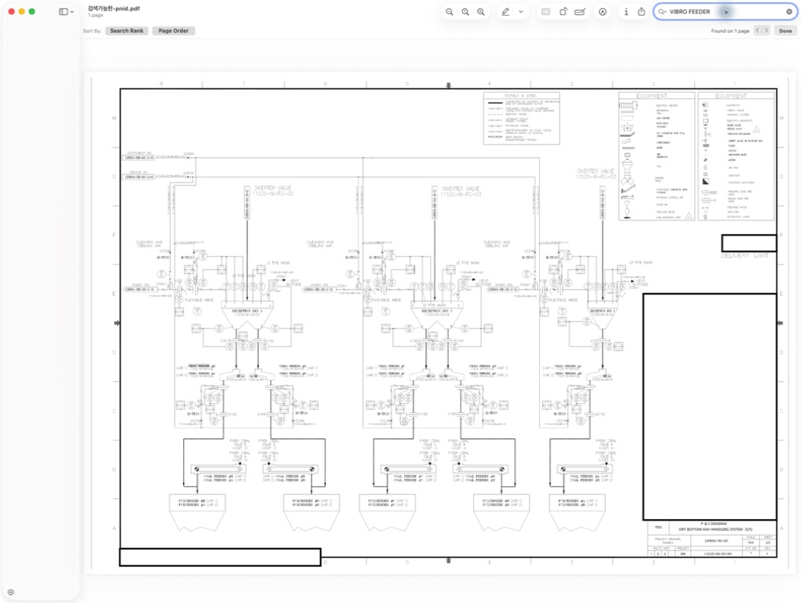
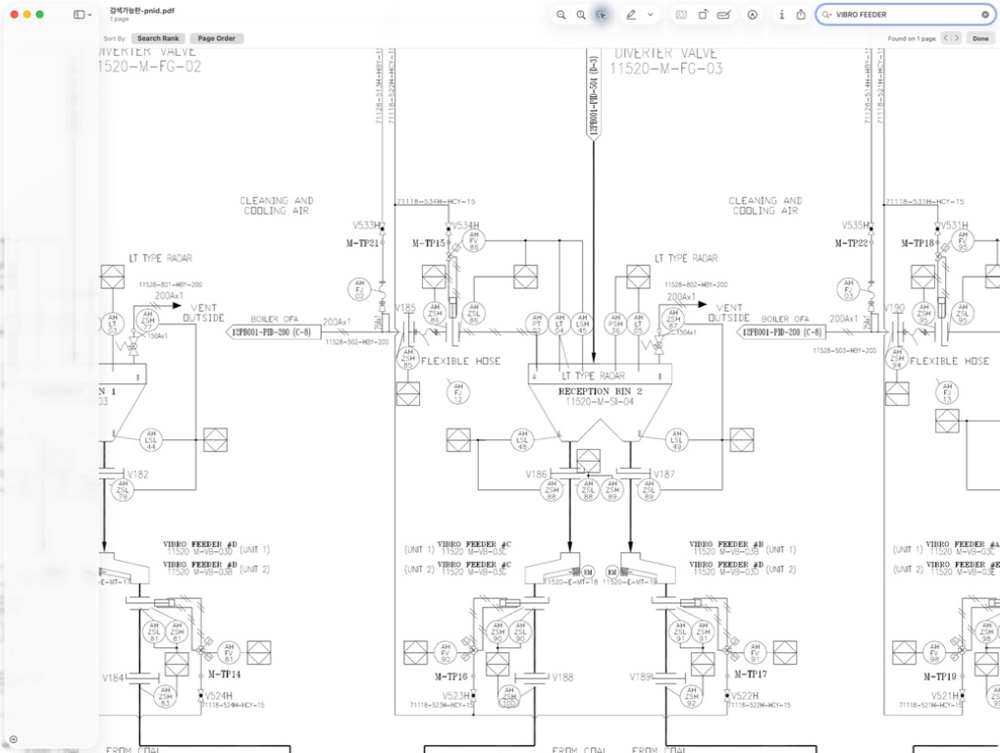

# OCR로 도면 검색하기

앞 단원에서는 같은 도면도 전체 이미지로 볼 때와 필요한 부분을 확대해서 볼 때 답변이 달라질 수 있다는 점을 확인했습니다. 이번에는 이미지 안의 글자를 검색할 수 있게 만들어 봅니다.

이 단원에서는 준비된 `실습자료/ocr/검색가능한-pnid.pdf`를 사용합니다. 이 파일에서는 `Ctrl+F`로 `VIBRO FEEDER`를 찾을 수 있습니다. 사람이 문자열을 검색할 수 있게 되면 AI 에이전트도 긴 도면에서 관련 단어를 먼저 찾고, 확인해야 할 구역을 더 빠르게 좁힐 수 있습니다.

<div class="lesson-summary">
  <p class="lesson-summary__label">이 단원에서 할 일</p>
  <ul>
    <li>OCR이 적용된 도면에서 문자열을 검색하고 원본 이미지로 검증합니다.</li>
    <li>검색 결과를 원본 이미지의 위치와 다시 대조합니다.</li>
  </ul>
  <p class="lesson-summary__outcome"><strong>완료 기준:</strong> PDF에서 태그를 검색하고 판독 결과를 원본에서 검증할 수 있습니다.</p>
</div>

<div class="scope-note">
  <p class="scope-note__label">P&amp;ID 밖에서도 사용할 수 있습니다</p>
  <p>P&amp;ID를 예제로 사용하지만 같은 원리를 스캔한 매뉴얼, 설비 도면, 검사 성적서, 오래된 양식, 이미지 기반 PDF에도 적용할 수 있습니다. <strong>눈에는 보이지만 검색되지 않는 문서</strong>라면 텍스트 레이어를 추가하고, 언어·배치·글자 크기에 맞춰 OCR 설정과 검증 기준을 조정합니다.</p>
</div>

## OCR을 적용하면 무엇이 달라지나요?

원본 PDF에서 글자는 선명하게 보입니다. 하지만 PDF 문자 데이터가 아니라 그림에 포함된 픽셀이어서 마우스 선택과 `Ctrl+F` 검색이 작동하지 않습니다.

OCR은 그림 속 글자를 읽어 같은 위치에 보이지 않는 문자를 겹쳐 놓습니다. 이 숨은 문자 정보를 텍스트 레이어라고 합니다. <mark class="text-highlight">텍스트 레이어를 추가하면 화면의 도면은 그대로 유지하면서 문자를 검색할 수 있습니다.</mark>

| 비교 항목 | 이미지로만 된 PDF | OCR을 적용한 PDF |
|---|---|---|
| 화면에 보이는 도면 | 원본과 동일 | 원본과 동일 |
| 문자 선택 | 할 수 없음 | 텍스트 레이어에서 가능 |
| `Ctrl+F` 검색 | 할 수 없음 | 가능 |
| 장비를 찾는 방법 | 이미지를 처음부터 살펴봄 | 문자열로 후보 위치를 먼저 좁힘 |
| 연결 관계 확인 | 원본 이미지를 봐야 함 | 여전히 원본 이미지를 봐야 함 |

OCR은 도면에서 확인할 위치를 좁혀 주는 검색 도구입니다. 장비 사이의 배관 연결이나 심벌의 의미는 이미지를 보고 확인해야 합니다. 이 단원에서도 OCR로 후보 위치를 찾은 뒤 원본 이미지로 답을 검증합니다.

## 원본 도면과 OCR 도면을 나란히 비교합니다

두 파일에는 같은 교육용 도면과 같은 공개용 마스킹이 들어 있습니다. 화면에 보이는 선, 심벌과 표기는 같고, OCR 도면에만 검색을 위한 숨은 텍스트 레이어가 추가되어 있습니다.

| 원본 고해상도 이미지 | OCR 검색 가능한 PDF |
|---|---|
| [원본 도면 열기](../실습자료/이미지/원본-고해상도-도면.png) | [검색 가능한 도면 열기](/pnid-understanding-bootcamp/downloads/검색가능한-pnid.pdf) |
| 도면의 선과 표기를 눈으로 확인합니다. 이미지이므로 문자를 선택하거나 검색할 수 없습니다. | 원본과 같은 화면 위에 OCR 텍스트 레이어가 겹쳐 있습니다. `Ctrl+F` 또는 `Command+F`로 문자를 검색할 수 있습니다. |

두 링크를 각각 새 탭으로 연 뒤 다음 순서로 비교해 보세요.

1. 두 파일에서 Reception Bin 2 주변을 비슷한 크기로 확대합니다.
2. 두 탭에서 각각 `VIBRO FEEDER`를 검색합니다.
3. 원본 이미지에서는 검색되지 않고 OCR PDF에서는 검색 결과가 표시되는지 확인합니다.
4. OCR이 찾은 위치를 원본 이미지에서 다시 보며 장비 태그, 밸브 번호와 연결선을 확인합니다.

<mark class="text-highlight">OCR PDF는 원본의 마킹이나 도면 선을 바꾼 파일이 아니라, 같은 도면에 검색용 문자 정보를 더한 파일입니다.</mark> 검색 결과가 실제 표기와 다르면 원본 이미지를 기준으로 판단합니다.

## 1. 준비된 OCR PDF에서 먼저 검색합니다

먼저 워크북에 포함된 검색 가능한 PDF를 엽니다.

[검색 가능한 P&ID 열기](/pnid-understanding-bootcamp/downloads/검색가능한-pnid.pdf)

로컬 파일을 사용한다면 `실습자료/ocr/검색가능한-pnid.pdf`를 Chrome, Edge, Adobe Acrobat 또는 macOS Preview로 엽니다. `Ctrl+F`를 누르고 `VIBRO FEEDER`를 검색합니다. macOS에서는 `Command+F`를 사용합니다.



검색 결과는 답이 아니라 확인할 위치의 후보입니다. Reception Bin 2 주변으로 확대하고 밸브, Feeder 태그와 전동기 표기를 원본 도면에서 다시 확인합니다.



다음 값도 차례로 검색해 보세요.

```text
RECEPTION BIN 2
V186
11520-M-VB-03C
```

OCR이 문자열을 놓치거나 다르게 읽어도 후보 위치를 좁힐 수 있습니다. 그 위치를 원본 이미지와 대조해 실제 표기를 확인하면 이 단원의 목표를 달성한 것입니다.

여기까지 완료했다면 다음 단원으로 진행해도 됩니다. 아래에서는 같은 파일을 직접 만들어 보고 싶은 참가자만 제작 과정을 이어갑니다.

## 선택 실습: Tesseract로 OCR PDF를 직접 만듭니다

`Tesseract`는 이미지에서 문자를 읽어 검색 가능한 텍스트 레이어를 만드는 오픈소스 OCR 프로그램입니다. 선택 실습에서는 전체 도면 이미지에 Tesseract 명령을 직접 실행하고 결과 PDF를 확인합니다.

### 2. 실행할 준비를 합니다

터미널을 열고 설치 여부를 확인합니다.

```bash
tesseract --version
```

버전 번호가 보이면 바로 다음 단계로 이동합니다. `command not found` 또는 "명령을 찾을 수 없습니다"가 나오면 아래에서 사용하는 환경 하나만 펼쳐 설치합니다.

<details class="practice-result">
  <summary>macOS에서 설치</summary>
  <div class="practice-result__body">

[Homebrew](https://brew.sh/)가 설치되어 있다면 다음 명령을 실행합니다.

```bash
brew install tesseract
```

  </div>
</details>

<details class="practice-result">
  <summary>Ubuntu에서 설치</summary>
  <div class="practice-result__body">

```bash
sudo apt update
sudo apt install -y tesseract-ocr
```

  </div>
</details>

<details class="practice-result">
  <summary>Windows에서 설치</summary>
  <div class="practice-result__body">

이 워크북의 명령을 동일하게 따라 하려면 WSL의 Ubuntu 환경을 권장합니다. WSL 준비가 끝난 뒤 위의 Ubuntu 설치 명령을 실행합니다. 설치와 터미널 초기 설정은 별도 환경 세팅 가이드를 참고하세요.

  </div>
</details>

### 3. 검색 가능한 PDF를 직접 만듭니다

터미널에서 압축을 푼 `pnid-ai-workbook-kit` 폴더로 이동합니다. macOS의 기본 다운로드 경로에 풀었다면 다음과 같이 입력합니다.

```bash
cd ~/Downloads/pnid-ai-workbook-kit
```

현재 위치가 맞는지 확인합니다.

```bash
pwd
```

이제 전체 도면 이미지에 Tesseract를 직접 실행합니다.

```bash
tesseract \
  실습자료/이미지/원본-고해상도-도면.png \
  실습자료/ocr/내가-만든-pnid \
  -l eng \
  --dpi 300 \
  --psm 11 \
  --user-words data/ocr/pnid-user-words.txt \
  -c thresholding_method=2 \
  -c preserve_interword_spaces=1 \
  pdf
```

각 부분의 의미는 다음과 같습니다.

| 명령 부분 | 의미 |
|---|---|
| 첫 번째 경로 | OCR을 적용할 입력 이미지 |
| `실습자료/ocr/내가-만든-pnid` | 확장자를 제외한 출력 파일 이름 |
| `-l eng` | 영어 문자 모델 사용 |
| `--dpi 300` | 입력 해상도를 300 DPI로 해석 |
| `--psm 11` | 도면처럼 여러 위치에 흩어진 글자를 탐색 |
| `--user-words data/ocr/pnid-user-words.txt` | 도면에서 확인한 P&ID 용어 46개를 사용자 단어 사전으로 사용 |
| `-c thresholding_method=2` | 조명과 배경이 균일하지 않은 이미지에 대한 적응형 이진화 사용 |
| `-c preserve_interword_spaces=1` | 인식된 단어 사이의 공백을 가능한 그대로 유지 |
| `pdf` | 보이는 이미지 위에 검색용 텍스트 레이어가 있는 PDF 생성 |

완료되면 `실습자료/ocr/내가-만든-pnid.pdf`가 생깁니다.

<details class="practice-result">
  <summary><code>build-ocr-assets.sh</code>는 언제 사용하나요?</summary>
  <div class="practice-result__body">

참가자 실습에는 필요하지 않습니다. 이 스크립트는 공개 워크북의 OCR 산출물을 한꺼번에 다시 만들 때 사용합니다. 검색 가능한 PDF뿐 아니라 전체 도면과 확대 구역의 좌표 TSV, PDF에서 추출한 텍스트 파일을 생성하고 다운로드 폴더에도 PDF를 복사합니다.

```bash
bash scripts/build-ocr-assets.sh
```

워크북을 수정하거나 결과 파일 전체를 재생성할 때만 사용하세요.

  </div>
</details>

### 4. 직접 만든 파일이 검색되는지 확인합니다

직접 만든 `실습자료/ocr/내가-만든-pnid.pdf`를 Chrome, Edge 또는 Adobe Acrobat으로 엽니다. `Ctrl+F`를 누르고 다음 문구를 검색합니다. macOS에서는 `Command+F`를 사용합니다.

```text
VIBRO FEEDER
```

다음 장비 태그도 검색해 봅니다.

```text
11520-M-SI-04
```

검색 결과가 표시되면 이미지 도면 위에 텍스트 레이어가 만들어진 것입니다. 그렇다고 모든 글자가 완벽하게 검색되지는 않습니다. 작은 글자나 선과 겹친 태그, 심벌 가까이에 있는 글자는 잘못 읽히거나 빠질 수 있습니다.

## OCR 품질이 아쉬울 때 무엇을 바꿀 수 있나요?

기본 실습을 마친 뒤 특정 태그가 계속 빠지거나 틀리게 읽힌다면 아래 항목을 하나씩 펼쳐 확인해 보세요. 여러 설정을 한꺼번에 바꾸면 무엇이 효과가 있었는지 알기 어려우므로, **한 번에 하나만 바꾸고 같은 검색어로 전후 결과를 비교**하는 것이 좋습니다.

<details class="practice-result">
  <summary>도면에 자주 나오는 장비명과 태그를 사용자 사전에 추가하기</summary>
  <div class="practice-result__body">

Tesseract의 사용자 단어 사전은 일반 영어 사전에 없는 `VIBRO`, `FEEDER`, 장비 태그 같은 문자열을 후보로 알려 줍니다. 먼저 한 줄에 한 단어씩 파일을 만듭니다.

```text title="data/ocr/pnid-user-words.txt"
BOILER
OFA
CONVEYOR
FLEXIBLE
RECEPTION
VIBRO
```

실제 예제 사전에는 도면에서 확인한 P&ID 용어 46개가 들어 있습니다. `ae`, `KA]`, `VN`처럼 선이나 심벌을 글자로 잘못 읽은 결과는 사전에서 제외했습니다.

그다음 기존 Tesseract 명령에 다음 옵션을 추가합니다.

```bash
--user-words data/ocr/pnid-user-words.txt
```

이 워크북의 `scripts/build-ocr-assets.sh`에는 위 사전이 이미 연결되어 있습니다. 직접 실행할 때의 전체 명령은 다음과 같습니다.

```bash
tesseract input.png output -l eng --psm 6 --user-words data/ocr/pnid-user-words.txt pdf
```

사전은 OCR이 비슷한 후보 사이에서 도메인 단어를 우선하도록 돕습니다. 흐릿한 글자를 선명하게 만들거나 사라진 글자를 복원하지는 못합니다. 실제 도면에서 확인한 단어만 넣고 예상한 정답을 무작정 추가하지 마세요.

  </div>
</details>

<details class="practice-result">
  <summary>글자가 흩어진 도면에 맞게 페이지 분할 모드 바꾸기</summary>
  <div class="practice-result__body">

`--psm`은 Tesseract가 글자의 배치를 어떻게 가정할지 정하는 옵션입니다. 일반 문서와 달리 글자가 여러 위치에 흩어진 P&ID에서는 `--psm 11`이 유용할 수 있습니다. 이 워크북의 스크립트는 전체 도면에 `--psm 11`, 잘라낸 확대 이미지에 `--psm 6`을 사용합니다.

```bash
tesseract input.png output-psm11 -l eng --psm 11 tsv
```

| 모드 | 가정 | 비교해 볼 상황 |
|---|---|---|
| `6` | 하나의 텍스트 블록 | 일정한 구역을 잘라낸 이미지 |
| `11` | 흩어진 글자를 가능한 만큼 탐색 | 전체 도면처럼 라벨 위치가 분산된 이미지 |
| `13` | 한 줄의 글자 | 장비 태그 한 줄만 아주 작게 잘라낸 이미지 |

도면마다 잘 맞는 모드가 다릅니다. 동일한 이미지로 TSV를 각각 만든 뒤 필요한 태그가 더 잘 남는 쪽을 선택합니다.

  </div>
</details>

<details class="practice-result">
  <summary>작은 글자는 먼저 확대하고 필요한 구역만 OCR하기</summary>
  <div class="practice-result__body">

<mark class="text-highlight">OCR 설정 자체보다 입력 이미지의 크기와 선명도가 더 큰 차이를 만드는 경우가 많습니다.</mark> 전체 도면의 작은 태그가 빠진다면 원본 PDF를 더 높은 해상도로 변환하거나, 필요한 구역을 잘라 2~4배 확대해 다시 OCR합니다. 이 워크북도 전체 도면과 `Feeder #C` 확대 이미지를 따로 처리합니다.

확대할 때는 화면 캡처보다 원본 PDF 또는 원본 고해상도 이미지에서 다시 추출하세요. 글자가 선과 겹쳐 있다면 회색조·이진화가 도움이 될 수 있지만, 너무 강한 이진화는 가는 글자 획을 없앨 수 있습니다. 원본, 확대본, 전처리본을 각각 남겨 비교하는 편이 안전합니다.

  </div>
</details>

<details class="practice-result">
  <summary>한국어가 섞인 도면에 언어 데이터 추가하기</summary>
  <div class="practice-result__body">

`-l eng`은 영어만 읽습니다. 한국어 설명이 함께 있는 도면이라면 한국어 언어 데이터를 설치하고 `eng+kor`로 실행할 수 있습니다.

```bash
# macOS
brew install tesseract-lang
```

```bash
# Ubuntu 또는 WSL
sudo apt install -y tesseract-ocr-kor
```

```bash
tesseract input.png output -l eng+kor --psm 6 pdf
```

설치된 언어는 `tesseract --list-langs`로 확인합니다. 사용하지 않는 언어를 많이 지정하면 처리 시간이 늘고 비슷한 글자를 혼동할 수 있으므로, 실제 도면에 있는 언어만 선택하세요.

  </div>
</details>

<details class="practice-result">
  <summary>개선됐는지 같은 기준으로 비교하기</summary>
  <div class="practice-result__body">

설정은 눈에 잘 보이는 몇 개의 결과보다 평가 목록을 기준으로 고릅니다. 먼저 반드시 찾아야 할 장비명과 태그 10~20개를 정하고, 각 설정에서 정확히 검색되는 개수를 기록합니다. 잘못 읽은 문자열과 놓친 문자열도 함께 남기면 다음에 사전, 확대, `--psm` 중 무엇을 바꿀지 판단하기 쉽습니다.

```text
설정: 기본(--psm 6) / 사전 추가 / --psm 11 / 구역 확대
확인: 정답 수 / 오인식 수 / 누락 수
```

최종 설정을 고른 뒤에도 OCR 문자열은 후보로만 사용하고 원본 이미지에서 다시 확인합니다.

  </div>
</details>

## 4. OCR 파일을 AI 에이전트와 함께 사용합니다

OCR을 적용하기 전에는 에이전트가 큰 이미지에서 장비 이름부터 눈으로 찾아야 합니다. OCR PDF를 함께 주면 `VIBRO FEEDER` 같은 문자열을 먼저 검색한 뒤 그 주변만 확대해 원본 이미지와 대조할 수 있습니다.

에이전트에게는 다음과 같이 역할을 분명히 알려 줍니다.

```text
OCR 텍스트는 검색 후보를 찾는 데만 사용해 주세요.
장비 태그와 배관 연결은 원본 이미지의 확대 구역에서 다시 확인해 주세요.
OCR과 이미지가 다르면 차이를 적고, 확인되지 않은 값은 추측하지 마세요.
```

이 지시가 필요한 이유는 글자를 잘 찾는 능력과 도면의 연결 관계를 정확히 읽는 능력이 서로 다르기 때문입니다. OCR에서 `VIBRO FEEDER`를 찾았더라도, 바로 위 장비나 옆의 밸브를 어느 피더에 연결해야 하는지는 이미지의 선을 따라가며 확인해야 합니다.

## 5. 실제 모델 답변에서는 어떤 변화가 있었나요?

이 워크북에서는 전체 이미지만 제공한 경우와 전체 이미지에 OCR 파일을 추가한 경우를 각각 한 번 비교했습니다.

| 모델 | 전체 이미지만 제공 | 전체 이미지와 OCR 제공 | 관찰한 변화 |
|---|---:|---:|---|
| Claude Sonnet | 3/4 | 3/4 | 전동기 태그는 맞아졌지만 가까운 밸브의 연결을 잘못 판단했습니다. |
| Codex Luna | 2/4 | 4/4 | OCR로 문자열 후보를 찾은 뒤 이미지에서 네 항목을 확인했습니다. |

이 결과는 모델의 보편적인 우열보다 이번 실험의 두 가지 관찰을 보여 줍니다. OCR을 추가하면 에이전트가 검색할 문자열이 늘어나고, 검색한 문자열은 반드시 이미지에서 다시 검증해야 합니다.

표의 항목별 채점과 관찰 메모는 `data/ocr/ocr-agent-comparison.csv`에서 확인할 수 있습니다.

## 이 단원에서 만든 작업 흐름

<div class="process-flow" style="--flow-columns: 5">
  <div class="process-step"><span class="process-step__number">1</span><strong>도구 설치 확인</strong></div>
  <div class="process-step"><span class="process-step__number">2</span><strong>검색 가능한 PDF 생성</strong></div>
  <div class="process-step"><span class="process-step__number">3</span><strong>문자열 검색 확인</strong></div>
  <div class="process-step"><span class="process-step__number">4</span><strong>후보 위치 탐색</strong></div>
  <div class="process-step"><span class="process-step__number">5</span><strong>원본에서 검증</strong></div>
</div>

다음 단계는 에이전트가 찾은 근거를 다른 사람도 같은 위치에서 확인하게 만드는 일입니다. 다음 단원에서는 도면의 특정 구역을 위치 상자로 표시하고 기록합니다.
