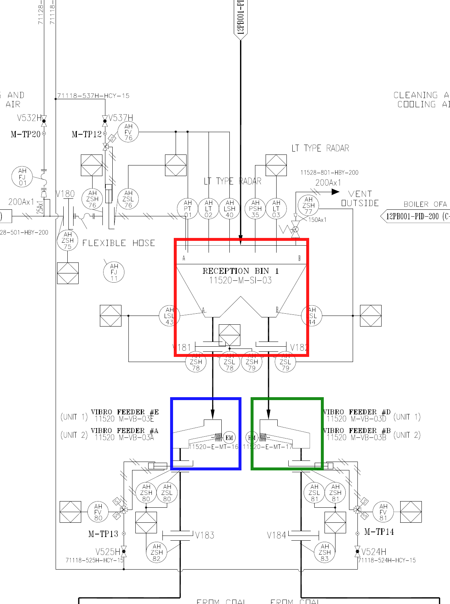

# AI 답변을 원본 위치와 연결하기

> **위치 상자 개념은 기본 내용이고, JSON과 마킹 이미지를 만드는 작업은 고급 선택 실습입니다.** 파일 생성 실습을 건너뛰어도 다음 단원으로 진행할 수 있습니다.

> 텍스트 레이어는 도면에 무엇이라고 쓰였는지 검색하게 해 주고, 위치 상자는 그 글자와 판단 근거가 어디에 있는지 기록합니다. 위치 상자가 있으면 다른 사람이 같은 곳을 다시 보고 답을 검토할 수 있습니다.

앞 단원에서는 OCR로 도면에 검색 가능한 텍스트 레이어를 만들고, 검색 결과를 원본 이미지에서 다시 확인했습니다. 이제 찾은 글자와 판단 근거의 위치를 다른 사람도 다시 확인할 수 있도록 기록해 보겠습니다.

그러나 답변에 `이미지 왼쪽 아래에서 확인했습니다`라고만 적혀 있다면, 실행이 끝난 뒤 정확한 위치를 다시 찾기 어렵습니다. 같은 이미지에 장비가 여러 개 반복되면 더욱 그렇습니다.

이때 위치 상자를 사용합니다.

<div class="lesson-summary">
  <p class="lesson-summary__label">이 단원에서 할 일</p>
  <ul>
    <li>답변을 다시 확인할 수 있는 근거 구역을 표시합니다.</li>
    <li>위치 상자와 OCR 텍스트의 좌표를 연결합니다.</li>
  </ul>
  <p class="lesson-summary__outcome"><strong>완료 기준:</strong> 다른 사람이 같은 위치에서 판단 근거를 재검토할 수 있습니다.</p>
</div>

## 위치 상자는 무엇인가요?

도면 위에 투명한 사각형 스티커를 붙여 특정 부분을 가리킨다고 생각해 보세요. 다른 사람은 긴 설명을 읽지 않아도 사각형 안을 보면 됩니다.

컴퓨터 비전에서는 이 사각형을 `bounding box`라고 부르며, 보통 `bbox`라고 줄여 씁니다. 이 워크북에서는 먼저 `위치 상자`라는 쉬운 표현을 사용합니다.

`bbox`라는 용어보다 아래 두 질문부터 이해하면 됩니다.

1. 이 상자는 어떤 근거를 가리킵니까?
2. 이 상자만 보고 다른 사람이 같은 판단을 검토할 수 있습니까?

## Feeder #C 질문의 근거 위치를 표시해 봅니다


이 이미지에는 파란 상자가 하나 있습니다.

파란 상자는 Feeder #C 질문을 검토하기 위한 구역입니다. 이 안에서 Reception Bin 2의 A측 하부, `V186`, `VIBRO FEEDER #C`, `11520-M-VB-03C`, `EM / 11520-E-MT-18`을 함께 볼 수 있습니다.

이 상자는 <mark class="text-highlight">질문의 여러 단서를 함께 검토할 수 있도록 넓게 잡은 근거 구역입니다.</mark> 부품 하나만 정밀하게 감싸는 상자보다 주변 연결 관계까지 보여 줍니다.

## 왜 객체 하나만 감싸지 않았나요?

위치 상자의 크기는 질문의 목적에 따라 달라집니다.

`VIBRO FEEDER #C라는 글자가 어디에 있습니까?`만 묻는다면 글자 주변을 작게 감싸도 됩니다.

하지만 `Reception Bin 2의 A측 출구가 어떤 밸브를 거쳐 Feeder #C와 전동기까지 연결됩니까?`라고 묻는다면 Bin 하부, 밸브, Feeder와 전동기를 함께 봐야 합니다. 이 경우에는 조금 넓은 근거 구역이 필요합니다.

위치 상자의 크기는 판단에 필요한 문맥을 기준으로 정합니다. 태그뿐 아니라 연결 관계도 검토해야 한다면 주변 영역까지 담으세요.

## 위치 상자는 어떤 종류로 나눌 수 있나요?

### 근거 구역

현업 질문에 답하기 위해 여러 단서를 함께 보여 주는 넓은 상자입니다. Feeder #C 질문의 파란 상자가 여기에 해당합니다.

### 객체 상자

장비나 계기 하나의 외곽을 가깝게 감싸는 상자입니다. 객체 탐지나 장비 수량을 평가할 때 사용합니다.



이 그림의 빨간 상자는 Reception Bin 1, 파란색과 초록색 상자는 각각 Vibro Feeder를 가리킵니다. 이 예시는 객체별 데이터셋을 더 자세히 만들 때 사용하는 확장 자료입니다.

### 글자 상자

OCR이 읽은 단어나 태그 문자열의 위치를 감싸는 작은 상자입니다. `RECEPTION`, `BIN`, `1`처럼 한 장비 이름이 여러 단어로 나뉘어 인식될 수 있습니다.

| 종류 | 무엇을 확인하나요? | 보통 크기 |
|---|---|---|
| 근거 구역 | 질문에 필요한 여러 단서와 연결 관계 | 넓음 |
| 객체 상자 | 장비나 계기 하나 | 중간 |
| 글자 상자 | OCR이 읽은 단어나 태그 | 작음 |

## 위치를 숫자로 저장하는 방법

사각형을 파일에 저장하려면 네 개의 숫자를 사용합니다.

```text
[왼쪽 위 x, 왼쪽 위 y, 오른쪽 아래 x, 오른쪽 아래 y]
```

이미지의 가장 왼쪽 위를 `(0, 0)`으로 생각합니다. 오른쪽으로 갈수록 x가 커지고, 아래로 갈수록 y가 커집니다.

파란 근거 구역은 `실습자료/이미지/feeder-c-원본-확대.png`라는 1330×1710 픽셀 확대 이미지를 기준으로 합니다. 내부 좌표는 다음과 같습니다.

```text
왼쪽 위: (220, 700)
오른쪽 아래: (750, 1550)
위치 상자: [220, 700, 750, 1550]
```

처음에는 이 좌표를 직접 측정하지 않아도 됩니다. 네 숫자가 사각형의 두 모서리를 저장한다는 뜻만 이해하면 됩니다.

## 확대 이미지와 전체 도면의 좌표는 다릅니다

Feeder #C 주변 확대 이미지는 전체 도면의 일부를 잘라 크게 만든 이미지입니다. 확대 이미지의 왼쪽 위가 새롭게 `(0, 0)`이 됩니다.

같은 Feeder를 가리키더라도 확대 이미지에서 잰 좌표와 전체 도면에서 잰 좌표는 다릅니다.

이 부분 확대 영역은 전체 이미지에서 다음 위치에서 시작합니다.

```text
확대 이미지가 전체 도면에서 시작하는 점: (1740, 900)
```

확대 이미지 내부 좌표를 전체 좌표로 바꾸려면 확대 이미지가 시작하는 점을 더합니다.

```text
전체 x = 1740 + 확대 이미지 x
전체 y = 900 + 확대 이미지 y
```

파란 근거 구역을 전체 좌표로 바꾸면 다음과 같습니다.

```text
확대 이미지: [220, 700, 750, 1550]
전체: [1960, 1600, 2490, 2450]
```

데이터를 저장할 때에는 이 좌표가 어떤 이미지 기준인지 반드시 함께 적어야 합니다. 그렇지 않으면 숫자는 맞아도 전혀 다른 위치를 가리키게 됩니다.

## 위치 상자가 있으면 무엇이 가능해지나요?

위치 상자를 기록하면 다음과 같은 작업이 쉬워집니다.

- 검토자가 같은 위치를 바로 확인합니다.
- 다음 에이전트 실행에서 같은 구역만 잘라 고해상도로 전달합니다.
- Claude와 Codex가 서로 다른 위치를 근거로 삼았는지 비교합니다.
- 사람이 만든 기준 상자와 AI가 찾은 상자의 겹치는 정도를 계산합니다.
- OCR이 읽은 글자를 어느 장비에 연결할지 판단합니다.

## 텍스트 레이어와 위치 상자는 어떻게 연결되나요?

내부 원본 `원본-pnid.pdf`에는 검색 가능한 텍스트 레이어가 없습니다. 화면에는 글자가 보이지만 일반적인 텍스트 추출 결과는 0줄입니다.

이 워크북에서는 Tesseract OCR을 사용하여 검색 가능한 교육용 PDF와 위치가 포함된 OCR 결과를 만들었습니다.

- [검색 가능한 PDF](/pnid-understanding-bootcamp/downloads/검색가능한-pnid.pdf)
- 위치가 포함된 OCR 결과: `data/ocr/전체-도면-ocr.tsv`

OCR 결과에는 각 단어의 글자와 위치가 함께 들어 있습니다.

앞에서 `Reception Bin 1 구역`에 붙인 ID인 R02에서 OCR은 다음 단어를 읽었습니다.

| OCR 단어 | 신뢰도 | 전체 도면 좌표 |
|---|---:|---|
| RECEPTION | 95.61 | `[1034,1662,1160,1678]` |
| BIN | 94.90 | `[1177,1662,1215,1678]` |
| 1 | 77.74 | `[1233,1662,1241,1678]` |

세 단어의 위치는 모두 Reception Bin 1 객체 상자 안에 있습니다. 그래서 이 단어들을 `장비 1`을 뜻하는 ID인 E01의 이름 후보로 묶을 수 있습니다.

```text
RECEPTION + BIN + 1
        ↓
Reception Bin 1 객체 상자 안에 포함됩니다.
        ↓
E01의 이름 후보로 연결합니다.
```

OCR 신뢰도는 정답을 보장하는 점수가 아니라 검토 우선순위를 정하는 참고값입니다. OCR은 선이나 심벌을 글자로 잘못 읽거나 가까운 글자를 엉뚱한 장비와 연결할 수 있습니다. 위치 상자는 이런 결과를 원본과 대조할 출발점을 제공합니다.

## 위치 상자가 필요하지 않은 경우도 있습니다

“이 도면은 어떤 계통을 설명합니까?”처럼 제목과 큰 구조를 한 번 설명하는 탐색형 질문에는 숫자 좌표가 필요하지 않을 수 있습니다. “오른쪽 아래 제목란”, “중앙의 반복 구조” 같은 쉬운 위치 표현으로 충분합니다.

위치 상자는 다음 상황에서 중요해집니다.

- 결과를 다른 사람이 검토해야 합니다.
- 같은 위치를 다시 확대해야 합니다.
- 여러 모델의 결과를 비교해야 합니다.
- 데이터셋이나 평가 세트를 만들어야 합니다.
- OCR 단어를 장비나 태그에 연결해야 합니다.

즉, 위치 상자는 P&ID를 이해하기 위한 필수 의식이 아니라, AI의 답을 재사용하고 검증하기 위한 도구입니다.

## 위치 상자의 품질은 어떻게 확인하나요?

근거 구역을 확인할 때에는 다음 질문을 사용합니다.

- 질문에 필요한 글자와 심벌이 상자 안에 들어 있습니까?
- 상자 바깥의 전체 문맥을 함께 확인했습니까?
- 상자 안에 서로 다른 설비 요소가 있다면 구분해서 기록했습니까?
- 좌표 기준 이미지와 이미지 크기를 기록했습니까?
- 잘린 선이나 장비가 있다면 확인하지 못한 상태로 남겼습니까?

객체 탐지 평가에서는 두 상자가 얼마나 겹치는지를 나타내는 `IoU`라는 값을 계산하기도 합니다. 이 워크북의 Feeder #C 실습에서는 IoU를 계산하지 않고, 파란 구역이 필요한 근거를 포함하는지 사람이 직접 확인하면 충분합니다.

## 기본 확인: 네 답에 필요한 상자 범위를 정합니다

앞에서는 질문 전체를 검토할 수 있는 파란 근거 구역 하나를 사용했습니다. 이번에는 같은 질문의 답 네 개를 나누어 각각 위치 상자로 기록하고, 원본 위에 실제로 표시된 결과까지 확인합니다.

이 실습에서는 태그를 다시 판독하지 않습니다. 앞 단원에서 확인한 네 값을 위치 상자에 연결하는 데 집중합니다.

| ID | 표시할 근거 | 상자의 범위 |
|---|---|---|
| B1 | `RECEPTION BIN 2 / 11520-M-SI-04` | 두 줄의 글자 |
| B2 | A측 출구의 `V186` | A 표시, 번호와 밸브 심벌 |
| B3 | `VIBRO FEEDER #C / 11520 M-VB-03C` | UNIT 1·2의 두 글자 묶음 |
| B4 | `EM / 11520-E-MT-18` | 왼쪽 전동기 심벌과 태그 |

여기까지 읽고 네 상자가 무엇을 포함하고 무엇을 제외해야 하는지 설명할 수 있으면 기본 목표를 달성한 것입니다. 좌표 파일과 마킹 이미지를 직접 만들고 싶다면 아래 고급 선택 실습을 진행합니다.

## 고급 선택 실습: Sol로 bbox 결과 파일을 만듭니다

이 부분을 건너뛰어도 다음 단원을 이해하는 데 문제가 없습니다.

압축을 푼 `pnid-ai-workbook-kit` 폴더를 Codex의 작업 폴더로 열고 새 작업을 시작합니다. GPT-5.6 Sol을 선택한 뒤 `실습자료/이미지/feeder-c-원본-확대.png`를 첨부합니다. 이 워크북을 준비하면서 수행한 내부 bbox 비교에서 Sol이 좌표 측정과 마킹 결과의 시각 검토를 가장 안정적으로 수행했기 때문에 이 실습의 권장 모델로 지정했습니다.

PNG에 상자를 그리는 단계에서 Node.js의 `sharp`를 사용합니다. 터미널에서 `node --version`과 `npm --version`을 실행해 버전 번호가 나오는지 확인한 뒤, 이 폴더에서 `npm install`을 한 번 실행합니다. ZIP에 이 실습용 `package.json`이 포함되어 있습니다.

설치가 어렵다면 파일 생성을 중단하고, Sol에게 B1~B4의 좌표와 포함·제외 대상을 표로 답하게 하는 것까지만 진행해도 기본 목표는 달성한 것입니다.

그다음 `실습자료/프롬프트/bbox-네-근거-표시.txt`의 내용을 복사해 붙여 넣습니다.

```text
이 작업은 태그 판독 시험이 아니라 bbox 측정과 시각 검토 실습입니다.
`실습자료/이미지/feeder-c-원본-확대.png`에서 이미 확인된 네 근거를 찾아 각각 bbox로 표시해 주세요.

대상과 상자 범위:
- B1 `reception_bin_2_tag`: `RECEPTION BIN 2`와 `11520-M-SI-04` 두 줄의 글자만 감싸세요. Bin 본체 전체를 감싸지 마세요.
- B2 `valve_a_side`: A측 표시, `V186` 글자와 그 출구의 밸브 심벌을 한 상자에 넣으세요. `V187`은 제외하세요.
- B3 `feeder_c_tag`: 왼쪽에 있는 UNIT 1·UNIT 2의 `VIBRO FEEDER #C / 11520 M-VB-03C` 두 묶음의 글자만 한 상자에 넣으세요. 피더 본체와 모터, 오른쪽 Feeder #B/#D는 제외하세요.
- B4 `connected_motor_tag`: Feeder #C의 왼쪽 `EM` 심벌과 `11520-E-MT-18` 글자를 한 상자에 넣으세요. `11520-E-MT-19`는 제외하세요.

좌표 규칙:
- 먼저 원본 이미지의 실제 픽셀 크기를 확인하고 리사이즈하지 마세요.
- 원점은 왼쪽 위 `(0, 0)`입니다.
- bbox는 `[x_min,y_min,x_max,y_max]`의 `xyxy_exclusive` 픽셀 좌표입니다.
- 네 대상마다 bbox 하나를 만들고 하나의 큰 상자로 합치지 마세요.
- 상자 선이 글자나 심벌을 가리지 않도록 대상 바깥에 8~12px 여백을 두세요.

결과 파일:
1. `output/bbox-practice/bboxes.json`에 `image_path`, `image_size`, `coordinate_format`, `findings` 배열을 저장하세요.
2. `findings`의 각 원소는 `id`, `field`, `observed_text_or_symbol`, `bbox`, `confidence`, `note`를 포함해야 합니다.
3. `npm install`로 준비한 Node.js의 `sharp` 패키지를 사용해 원본 위에 B1~B4를 서로 다른 색의 5px 사각형으로 그리세요. 상자 바깥의 빈 공간에 B1~B4 라벨을 붙이고 `output/bbox-practice/marked.png`로 저장하세요.
4. 원본 이미지는 수정하지 마세요. 결과 PNG의 픽셀 크기는 원본과 같아야 합니다.
5. 저장한 `marked.png`를 실제로 열어 네 상자가 올바른 대상을 감싸는지 확인하세요. 글자나 심벌이 잘렸거나 제외 대상이 들어갔다면 좌표를 수정하고 다시 생성하세요.
6. 마지막으로 JSON 문법, 네 field의 중복·누락, 좌표 순서와 이미지 경계, 출력 PNG 크기를 검사하세요.
7. 완료 응답에는 두 결과 파일 경로, 네 bbox 좌표와 검사 결과만 간단히 적으세요.
```

### 마킹된 이미지를 검토합니다

실행이 끝나면 `output/bbox-practice/marked.png`를 열고 좌표 숫자보다 상자가 실제 근거를 잘 감싸는지 먼저 봅니다.

- B1이 Bin 본체 전체가 아니라 장비명과 태그 두 줄을 감쌌습니까?
- B2 안에 A 표시, `V186`과 밸브 심벌이 있고 `V187`은 빠졌습니까?
- B3이 왼쪽의 Feeder #C 태그 두 묶음을 담고 오른쪽 Feeder #B/#D와 모터를 제외했습니까?
- B4 안에 왼쪽 `EM / 11520-E-MT-18`이 있고 `11520-E-MT-19`는 빠졌습니까?
- 네 상자의 선이나 라벨이 원래 글자를 가리지 않습니까?
- `bboxes.json`의 이미지 크기와 `marked.png`의 픽셀 크기가 원본과 같습니까?

모델마다 몇 픽셀 정도 차이는 생길 수 있습니다. 정답 좌표 한 벌과 정확히 일치하는지보다, 필요한 근거를 빠짐없이 포함하고 인접한 다른 대상을 제외했는지를 우선 평가하세요.

고급 실습의 성공 결과는 다음 네 가지입니다.

- `output/bbox-practice/bboxes.json`이 생성되었습니다.
- `output/bbox-practice/marked.png`가 생성되었습니다.
- `marked.png`에서 B1~B4 네 상자가 올바른 근거를 감쌉니다.
- 원본 이미지의 내용과 픽셀 크기는 바뀌지 않았습니다.

## 다음 단원으로 넘어갑니다

이제 AI의 답이 원본 어디에서 나왔는지 연결할 수 있습니다. 하지만 답과 위치가 대화창과 이미지 파일에 흩어져 있으면 실행이 많아질수록 비교하기 어렵습니다.

다음 단원에서는 위치 상자를 도면 전체에 적용합니다. 제목란에서 기본정보를 읽고, 전체 도면을 한 문장으로 요약한 뒤, Reception Bin 1·2·3과 같은 큰 구역과 주요 태그를 JSON에 한 단계씩 추가합니다.

다음 단원에서는 모든 장비를 빠짐없이 추출하는 대신 도면의 의미와 주요 구역을 다시 찾을 수 있는 간단한 색인을 만듭니다.

## 단원 마무리

- **이번에 한 일:** 근거 구역·객체 상자·글자 상자의 차이와 좌표 기준을 확인했습니다.
- **확인할 결과:** B1~B4가 포함하고 제외해야 할 대상을 설명할 수 있습니다. 고급 실습을 했다면 JSON과 마킹 PNG도 확인했습니다.
- **실패해도 괜찮은 항목:** Node.js 설치나 파일 생성이 어려우면 좌표와 상자 범위만 검토하고 넘어가도 됩니다.
- **다음 단계:** 도면 기본정보, 큰 구역과 주요 태그를 하나의 JSON 색인으로 정리합니다.
