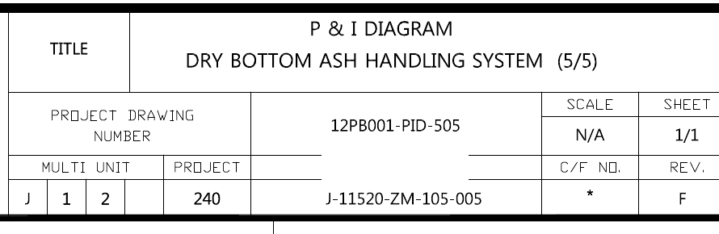
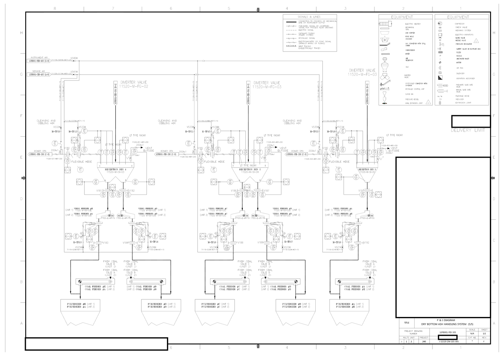
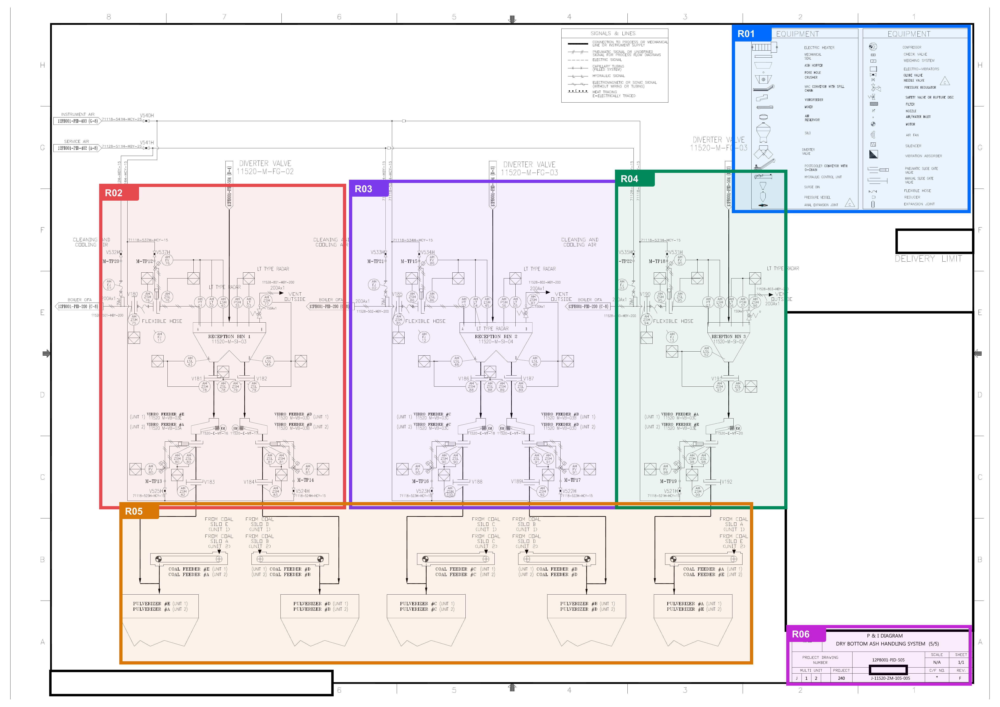
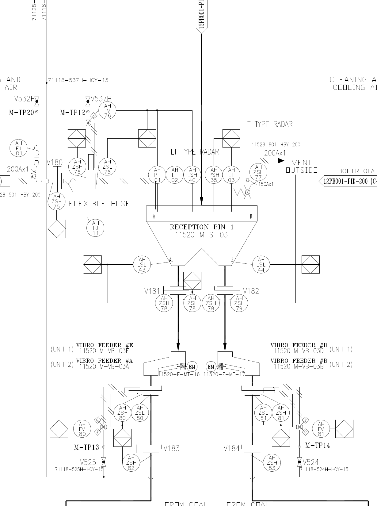

# P&ID 데이터 정리

> 이 단원에서는 P&ID의 모든 장비와 연결 관계를 추출하지 않습니다. 도면이 무엇을 나타내는지 빠르게 파악하고, 주요 구역과 태그를 다시 찾을 수 있는 수준으로 정리합니다.

앞 단원에서는 위치 상자로 이미지의 특정 지점을 다시 찾는 방법을 배웠습니다. 이번에는 그 방식을 도면 전체로 넓힙니다. 빈 JSON 파일에 도면 기본정보, 한 줄 요약, 큰 구역, 주요 태그를 한 단계씩 추가해 보겠습니다.

완성된 결과는 P&ID를 완전히 디지털화한 모델이 아닙니다. 사람이거나 AI 에이전트가 도면을 열기 전에 <mark class="text-highlight">어떤 도면인지, 어떤 큰 구역이 있는지, 어디를 먼저 확대할지 판단하는 간단한 색인</mark>입니다.

<div class="lesson-summary">
  <p class="lesson-summary__label">이 단원에서 할 일</p>
  <ul>
    <li>도면 기본정보와 한 줄 요약을 기록합니다.</li>
    <li>큰 구역과 주요 태그를 다시 찾을 수 있게 연결합니다.</li>
  </ul>
  <p class="lesson-summary__outcome"><strong>완료 기준:</strong> 도면을 열기 전에 내용과 확대 우선순위를 판단할 수 있는 색인을 만듭니다.</p>
</div>

## 1단계: 파일 하나에서 시작합니다

처음에는 다음 정보만 알고 있다고 가정합니다.

```json
{
  "file": "검색가능한-pnid.pdf"
}
```

파일명만으로는 이 도면이 어떤 계통을 설명하는지, 어느 revision인지 알 수 없습니다. 내용을 파악하려면 매번 PDF를 열어야 합니다.

## 2단계: 제목란에서 기본정보를 읽습니다

먼저 도면 오른쪽 아래의 제목란을 확인합니다.



제목란에서 직접 확인한 값을 JSON에 추가합니다.

```json
{
  "file": "검색가능한-pnid.pdf",
  "drawing_id": "J-11520-ZM-105-005",
  "title": "DRY BOTTOM ASH HANDLING SYSTEM (5/5)",
  "revision": "F",
  "sheet": "5/5"
}
```

이 정보가 있으면 이미지를 열지 않고도 도면번호, 제목, revision과 sheet를 확인할 수 있습니다. `5/5`는 같은 계통을 설명하는 다섯 장 중 다섯 번째 시트라는 뜻입니다.

## 3단계: 도면 전체를 한 문장으로 요약합니다

제목만으로는 이 시트에 어떤 설비가 나타나는지 충분히 알기 어렵습니다. 작은 태그를 읽으려 하지 말고, 전체 이미지에서 반복되는 큰 구조를 살펴봅니다.



이 도면에는 Reception Bin 계통이 세 번 반복되고, 각 Bin 아래에 출구와 Vibro Feeder가 배치되어 있습니다. 이 내용을 `summary` 한 문장으로 추가합니다.

```json
{
  "file": "검색가능한-pnid.pdf",
  "drawing_id": "J-11520-ZM-105-005",
  "title": "DRY BOTTOM ASH HANDLING SYSTEM (5/5)",
  "revision": "F",
  "sheet": "5/5",
  "summary": "세 개의 Reception Bin과 각 Bin 하부의 Vibro Feeder 및 관련 설비를 보여주는 P&ID"
}
```

`title`은 도면의 공식 이름이고, `summary`는 이 시트에서 실제로 볼 수 있는 큰 내용을 짧게 설명합니다. 요약에 모든 장비를 나열할 필요는 없습니다.

## 4단계: 도면을 큰 구역으로 나눕니다

다음으로 도면을 기능적으로 다시 찾아보기 쉬운 큰 구역으로 나눕니다. 지금 풀고 있는 Feeder #C 질문에 필요한 부분만 자르는 것이 아니라, 도면 전체의 반복 구조와 정보 역할을 기준으로 정합니다.

이 도면에서는 다음 여섯 구역부터 시작할 수 있습니다.



| ID | 구역 | 포함하는 내용 |
|---|---|---|
| R01 | legend | 심벌과 선 형식을 설명하는 범례 |
| R02 | Reception Bin 1 system | Reception Bin 1과 하부 출구 및 Feeder |
| R03 | Reception Bin 2 system | Reception Bin 2와 하부 출구 및 Feeder |
| R04 | Reception Bin 3 system | Reception Bin 3과 하부 출구 및 Feeder |
| R05 | downstream connections | 세 Bin 계통 아래의 공통 연결부 |
| R06 | title block | 도면번호, 제목, revision과 sheet 정보 |

Reception Bin 1 구역을 확대하면 하나의 큰 region에 Bin 본체와 하부 설비가 함께 들어가는 것을 볼 수 있습니다.



region은 장비 하나의 외곽을 정밀하게 따는 픽셀 마스크가 아닙니다. 다시 살펴볼 의미가 있는 넓은 사각형 영역입니다. 좌표는 원본 이미지 왼쪽 위를 원점으로 하는 `[x_min, y_min, x_max, y_max]` 형식으로 기록합니다.

```json
{
  "file": "검색가능한-pnid.pdf",
  "drawing_id": "J-11520-ZM-105-005",
  "title": "DRY BOTTOM ASH HANDLING SYSTEM (5/5)",
  "revision": "F",
  "sheet": "5/5",
  "summary": "세 개의 Reception Bin과 각 Bin 하부의 Vibro Feeder 및 관련 설비를 보여주는 P&ID",
  "regions": [
    {
      "id": "R01",
      "name": "legend",
      "bbox": [3640, 130, 4810, 1050]
    },
    {
      "id": "R02",
      "name": "Reception Bin 1 system",
      "bbox": [500, 920, 1710, 2520]
    },
    {
      "id": "R03",
      "name": "Reception Bin 2 system",
      "bbox": [1740, 900, 3060, 2520]
    },
    {
      "id": "R04",
      "name": "Reception Bin 3 system",
      "bbox": [3060, 850, 3900, 2520]
    },
    {
      "id": "R05",
      "name": "downstream connections",
      "bbox": [600, 2500, 3730, 3290]
    },
    {
      "id": "R06",
      "name": "title block",
      "bbox": [3910, 3110, 4815, 3395]
    }
  ]
}
```

구역은 조금씩 겹쳐도 괜찮습니다. 하부 연결을 이해하려면 R02, R03, R04의 아래쪽과 R05의 위쪽이 함께 보여야 할 수도 있습니다. 도면을 빈틈없이 조각내기보다 다음 탐색을 시작할 만한 구역을 만드는 데 초점을 맞추세요.

## 5단계: 구역마다 짧은 설명을 붙입니다

`name`만으로 구역의 범위를 설명하기 어렵다면 `summary`를 추가합니다. 앞에서 만든 R03에 아래처럼 정보를 보탤 수 있습니다.

```json
{
  "id": "R03",
  "name": "Reception Bin 2 system",
  "summary": "Reception Bin 2와 하부 A/B 출구, Vibro Feeder 및 Motor가 포함된 구역",
  "bbox": [1740, 900, 3060, 2520]
}
```

구역 설명도 완전한 설비 목록일 필요는 없습니다. 어떤 질문이 들어왔을 때 이 구역을 살펴봐야 하는지 판단할 수 있을 정도면 충분합니다.

## 6단계: 주요 태그를 구역과 연결합니다

마지막으로 도면에서 검색할 가치가 있는 주요 태그를 기록합니다. 모든 글자를 한 번에 추출하려 하지 말고, 원본 확대 이미지에서 확인한 태그부터 추가합니다.


이 확대 이미지에서 확인한 네 태그를 R03과 연결해 보겠습니다.

```json
{
  "tags": [
    {
      "tag": "11520-M-SI-04",
      "region": "R03"
    },
    {
      "tag": "V186",
      "region": "R03"
    },
    {
      "tag": "11520-M-VB-03C",
      "region": "R03"
    },
    {
      "tag": "11520-E-MT-18",
      "region": "R03"
    }
  ]
}
```

여기서는 태그 사이의 모든 연결 관계를 만들지 않습니다. <mark class="text-highlight">어떤 태그가 이 도면에 있고, 어느 큰 구역에서 다시 확인할 수 있는지 기록하는 것</mark>이 목표입니다.

OCR이 제안한 문자열을 바로 태그 목록에 넣어서는 안 됩니다. 선이나 심벌을 문자로 잘못 인식할 수 있으므로 확대된 원본에서 확인한 값을 추가합니다. 읽기 어려운 태그는 억지로 채우지 않고 나중에 더 선명한 이미지로 확인합니다.

## 7단계: 완성된 도면 레코드를 확인합니다

지금까지 추가한 내용을 한 파일에 모으면 다음과 같습니다.

```json
{
  "file": "검색가능한-pnid.pdf",
  "drawing_id": "J-11520-ZM-105-005",
  "title": "DRY BOTTOM ASH HANDLING SYSTEM (5/5)",
  "revision": "F",
  "sheet": "5/5",
  "summary": "세 개의 Reception Bin과 각 Bin 하부의 Vibro Feeder 및 관련 설비를 보여주는 P&ID",
  "regions": [
    {
      "id": "R01",
      "name": "legend",
      "summary": "도면에서 사용하는 주요 심벌과 선 형식을 설명하는 구역",
      "bbox": [3640, 130, 4810, 1050]
    },
    {
      "id": "R02",
      "name": "Reception Bin 1 system",
      "summary": "Reception Bin 1과 하부 출구 및 Feeder가 포함된 구역",
      "bbox": [500, 920, 1710, 2520]
    },
    {
      "id": "R03",
      "name": "Reception Bin 2 system",
      "summary": "Reception Bin 2와 하부 A/B 출구, Vibro Feeder 및 Motor가 포함된 구역",
      "bbox": [1740, 900, 3060, 2520]
    },
    {
      "id": "R04",
      "name": "Reception Bin 3 system",
      "summary": "Reception Bin 3과 하부 출구 및 Feeder가 포함된 구역",
      "bbox": [3060, 850, 3900, 2520]
    },
    {
      "id": "R05",
      "name": "downstream connections",
      "summary": "세 Reception Bin 계통 아래의 공통 연결부가 포함된 구역",
      "bbox": [600, 2500, 3730, 3290]
    },
    {
      "id": "R06",
      "name": "title block",
      "summary": "도면번호, 제목, revision과 sheet 정보가 있는 구역",
      "bbox": [3910, 3110, 4815, 3395]
    }
  ],
  "tags": [
    {
      "tag": "11520-M-SI-04",
      "region": "R03"
    },
    {
      "tag": "V186",
      "region": "R03"
    },
    {
      "tag": "11520-M-VB-03C",
      "region": "R03"
    },
    {
      "tag": "11520-E-MT-18",
      "region": "R03"
    }
  ]
}
```

처음에는 파일명 하나뿐이었지만 이제 다음 질문에 답할 수 있습니다.

- 이 파일은 어떤 도면이며 revision은 무엇입니까?
- 이 시트는 어떤 설비를 보여 줍니까?
- 도면에서 어떤 큰 구역을 먼저 살펴볼 수 있습니까?
- 특정 태그는 어느 구역에서 다시 확인할 수 있습니까?

## 여러 도면으로 확장할 수도 있습니다

지금은 P&ID 한 장만 정리했습니다. 여러 도면의 `title`, `summary`, `regions`, `tags`를 같은 형식으로 저장해 두면 AI 에이전트가 작업 전에 각 도면의 의미를 빠르게 파악할 수 있습니다.

예를 들어 질문에 `Reception Bin 2`나 `V186`이 들어 있다면 모든 PDF를 처음부터 자세히 읽는 대신 관련 도면과 region을 먼저 후보로 고를 수 있습니다. 이 워크북에서는 여러 도면을 검색하는 시스템까지 구현하지 않습니다. 여기서 만든 간단한 도면 레코드가 이후 문서 검색과 에이전트 탐색의 입력으로 확장될 수 있다는 점만 기억하면 충분합니다.

## 다음 단원으로 넘어갑니다

이번 단원에서는 P&ID 한 장 자체를 검색 가능한 레코드로 정리했습니다. 다음 단원에서는 구조화의 대상을 바꾸어, 특정 질문에 대한 AI의 자연어 답변을 검색하고 비교할 수 있는 표로 만듭니다.
