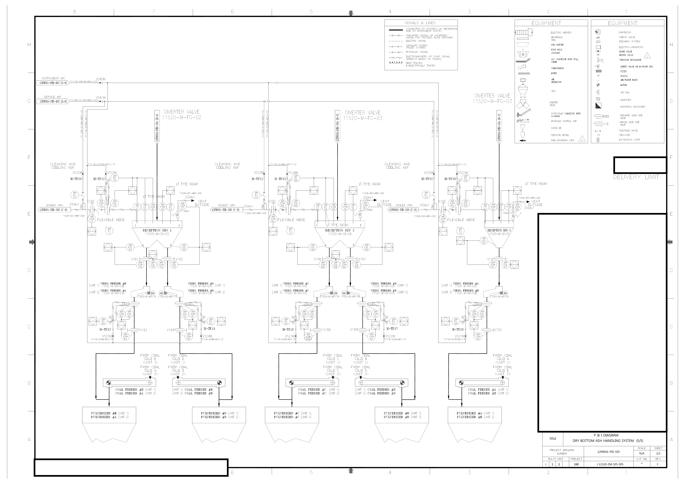

# 09. 참고: 원본 PDF에서 학습 이미지까지

> 이 부록은 원본 PDF를 분석용 이미지로 준비하는 과정을 직접 재현하고 싶을 때 사용합니다. 핵심 워크북을 읽는 데에는 이미 준비된 이미지를 사용해도 충분합니다.

## 학습 목표

- 원본, 임시 작업물, 최종 산출물을 구분합니다.
- PDF가 텍스트형인지 이미지형인지 확인합니다.
- 페이지를 분석에 충분한 해상도의 PNG로 렌더링합니다.
- 해상도와 좌표계가 데이터에 미치는 영향을 이해합니다.

## 1단계: 원본을 식별한다

```yaml
document_id: J-11520-ZM-105-005
revision: F
page_count: 1
page_size: A3
sha256: 15e99bc0f1df2ba816150f2ddbb8c19c2513d1628afa9d69efe7b41a6d8810cc
source_policy: immutable
```

체크섬은 파일의 지문입니다. 파일명이 같아도 내용이 바뀌면 체크섬이 달라진다.

## 2단계: PDF의 성질을 조사한다

- 1페이지
- A3, 842 × 1191pt
- 회전 메타데이터 270도이며, 렌더링 결과는 사람이 읽는 가로 방향
- 암호화 없음
- 텍스트 추출 결과 0줄

`텍스트 0줄`은 파일이 비었다는 뜻이 아닙니다. 글자가 페이지 그림의 일부로 존재해 일반 텍스트 추출기가 읽을 수 없다는 뜻입니다.

초심자용 에이전트 요청:

> 원본 PDF를 수정하지 마. 먼저 파일 상태만 조사하고 페이지 수, 크기, 회전, 암호화, 텍스트 추출 가능 여부를 표로 보고해. 텍스트가 없으면 이미지 렌더링 계획을 제안하되 아직 분석은 시작하지 마.

## 3단계: 고해상도로 렌더링한다

아래 명령은 터미널을 사용할 수 있을 때 선택적으로 실행합니다. 명령어를 이해하거나 외우는 것은 핵심 학습 목표가 아닙니다.

```bash
pdftoppm -png -r 300 -f 1 -singlefile \
  "source/원본-pnid.pdf" \
  실습자료/이미지/원본-고해상도-도면
```

결과 크기:

```text
width: 4963px
height: 3509px
origin: top-left
x direction: left to right
y direction: top to bottom
```



## 4단계: 렌더링을 검사한다

- [ ] 페이지가 올바른 방향인가?
- [ ] 네 모서리와 제목란이 잘리지 않았는가?
- [ ] 얇은 배관선이 끊기지 않았는가?
- [ ] 태그를 확대했을 때 글자 형태가 남아 있는가?
- [ ] 이미지 크기를 기록했는가?

## 흔한 실패

| 실패 | 결과 | 수정 |
|---|---|---|
| 화면 캡처만 사용 | 축척과 좌표가 매번 바뀜 | 고정 dpi로 렌더링 |
| 메신저로 이미지 전달 | 자동 리사이즈와 압축 | 원본 PNG 파일 사용 |
| 회전 후 좌표 기록 누락 | bbox가 다른 위치를 가리킴 | 최종 기준 이미지 크기 기록 |
| OCR 결과만 신뢰 | 선과 태그 관계 유실 | 이미지 근거와 병행 |

## 독자 체크포인트

- [ ] 원본을 `source/`에 보존했다.
- [ ] SHA-256을 기록했다.
- [ ] 텍스트 추출 가능 여부를 확인했다.
- [ ] 300dpi 전체 PNG를 만들었다.
- [ ] 이미지 크기와 좌표 원점을 기록했다.
- [ ] 전체 페이지를 육안 검사했다.

## 기억할 한 문장

PDF가 잘 안 읽히면 AI를 탓하기 전에 `AI가 실제로 볼 입력이 무엇인지` 확인합니다.
